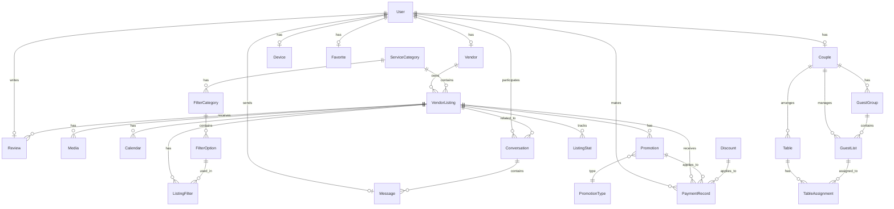

# Dokumentacja Techniczna WeddingApp

[TOC]

---

## 1. Architektura i Ogólny Przepływ Danych

### 1.1. Architektura Systemu

WeddingApp to aplikacja webowa oparta na architekturze klient-serwer z wyraźnym podziałem na frontend i backend:

```ascii
+----------------+     HTTP/REST     +----------------+     SQL     +----------------+
|    Frontend    |<----------------->|    Backend     |<---------->|  Baza Danych   |
|    (React)     |     requests     |   (Node.js)    |   queries  |    (MySQL)     |
+----------------+                   +----------------+            +----------------+
```

#### Frontend (React + TypeScript)
- **Warstwa prezentacji** (`src/components/`, `src/pages/`)
- **Zarządzanie stanem** (Redux store)
- **Warstwa komunikacji** (Axios dla zapytań HTTP)
- **Routing** (React Router)

#### Backend (Node.js + Express)
- **API REST** (`src/routes/`)
- **Warstwa biznesowa** (`src/controllers/`)
- **Warstwa dostępu do danych** (`src/models/`)
- **Middleware** (`src/middleware/`)

#### Baza Danych
- MySQL z ORM Sequelize
- Przechowywanie wszystkich danych aplikacji

### 1.2. Przepływ Danych

#### Przykładowy przepływ dla operacji odczytu:
```ascii
[Frontend]                [Backend]                [Database]
    |                         |                        |
    |--- HTTP GET ----------->|                        |
    |                         |--- SQL Query --------->|
    |                         |<-- Data --------------|
    |<-- JSON Response -------|                        |
    |                         |                        |
```

#### Przykładowy przepływ dla operacji zapisu:
```ascii
[Frontend]                [Backend]                [Database]
    |                         |                        |
    |--- HTTP POST --------->|                        |
    |                        |-- Validate Data        |
    |                        |-- SQL Insert --------->|
    |                        |<-- Confirmation -------|
    |<-- Status 200 ---------|                        |
    |                        |                        |
```

### 1.3. Główne Zależności Między Modułami

#### 1.3.1. Kluczowe Powiązania w Bazie Danych

1. **Użytkownicy i Role**:
   - **User -> Role**:
     - User <-> Vendor (one-to-one): Konto usługodawcy z dodatkowymi informacjami biznesowymi
     - User <-> Couple (one-to-one): Konto pary młodej z informacjami o weselu
     - User <-> Device (one-to-many): Urządzenia używane do logowania i powiadomień
   
   - **Szczegóły implementacji**:
     ```typescript
     // Przykład relacji w modelach
     User.hasOne(Vendor)
     User.hasOne(Couple)
     User.hasMany(Device)
     ```

2. **Zarządzanie Ofertami**:
   - **Vendor -> Oferty**:
     - Vendor <-> VendorListing (one-to-many): Ogłoszenia usługodawcy
       - Zawiera: title, description, price, availability
     - VendorListing <-> Category (many-to-one): Kategoria usługi
       - Kategorie: Fotografia, Wideofilmowanie, DJ, Zespoły, etc.
     - VendorListing <-> Review (one-to-many): Opinie klientów
     - VendorListing <-> ListingStat (one-to-one): Statystyki wyświetleń i kontaktów
     - VendorListing <-> Image (one-to-many): Zdjęcia oferty
   
   - **Szczegóły implementacji**:
     ```typescript
     // Przykład relacji
     Vendor.hasMany(VendorListing)
     VendorListing.belongsTo(Category)
     VendorListing.hasMany(Review)
     VendorListing.hasOne(ListingStat)
     ```

3. **Planowanie Weselne**:
   - **Couple -> Zarządzanie**:
     - Couple <-> Guest (one-to-many): Lista gości weselnych
       - Informacje: imię, nazwisko, status, preferencje menu
     - Couple <-> Table (one-to-many): Plan stołów
       - Właściwości: numer, pojemność, typ
     - Guest <-> Table (many-to-many): Przypisanie gości do stołów
       - Dodatkowe info: miejsce przy stole
     - Couple <-> Task (one-to-many): Lista zadań do wykonania
   
   - **Szczegóły implementacji**:
     ```typescript
     // Przykład relacji
     Couple.hasMany(Guest)
     Couple.hasMany(Table)
     Guest.belongsToMany(Table, { through: 'GuestTable' })
     ```

4. **System Komunikacji**:
   - **Konwersacje i Wiadomości**:
     - User <-> Conversation (many-to-many): Konwersacje między użytkownikami
       - Właściwości: uczestnicy, status, ostatnia aktywność
     - Conversation <-> Message (one-to-many): Wiadomości w konwersacji
       - Zawartość: tekst, załączniki, status odczytu
     - User <-> Notification (one-to-many): Powiadomienia systemowe
       - Typy: nowa wiadomość, zmiana statusu, przypomnienia
   
   - **Szczegóły implementacji**:
     ```typescript
     // Przykład relacji
     User.belongsToMany(Conversation, { through: 'UserConversation' })
     Conversation.hasMany(Message)
     User.hasMany(Notification)
     ```

#### 1.3.2. Struktura Modułów i Przepływ Danych

1. **Frontend (React + TypeScript)**:
   ```ascii
   src/
   ├── components/          # Komponenty wielokrotnego użytku
   │   ├── auth/           # Komponenty autoryzacji
   │   ├── listings/       # Komponenty ofert
   │   ├── planning/       # Komponenty planowania weselnego
   │   └── common/         # Współdzielone komponenty
   ├── pages/              # Widoki aplikacji
   ├── redux/              # Zarządzanie stanem
   │   ├── slices/        # Reduktory i akcje
   │   └── store.ts       # Konfiguracja Redux
   ├── services/           # Komunikacja z API
   └── utils/              # Funkcje pomocnicze
   ```

2. **Backend (Node.js + Express)**:
   ```ascii
   src/
   ├── controllers/        # Logika biznesowa
   │   ├── auth/          # Kontrolery autoryzacji
   │   ├── listings/      # Kontrolery ofert
   │   └── planning/      # Kontrolery planowania
   ├── models/            # Modele Sequelize
   ├── routes/            # Definicje endpointów
   ├── middleware/        # Middleware
   └── services/          # Serwisy zewnętrzne
   ```

#### 1.3.3. Systemy Powiązane i Ich Integracje

1. **System Autentykacji i Autoryzacji**:
   - **Komponenty**:
     - JWT dla sesji użytkownika
     - Passport.js dla strategii logowania
     - Role i uprawnienia (RBAC)
   - **Przepływ autoryzacji**:
     ```ascii
     [Login Request] -> [Passport Strategy] -> [JWT Generation] -> [User Session]
     ```

2. **System Powiadomień**:
   - **Typy powiadomień**:
     - W aplikacji (real-time przez WebSocket)
     - Email (poprzez nodemailer)
     - Push (dla urządzeń mobilnych)
   - **Obsługa zdarzeń**:
     ```ascii
     [Event] -> [Notification Service] -> [Queue] -> [Delivery System]
     ```

3. **System Komunikacji**:
   - **Funkcjonalności**:
     - Chat w czasie rzeczywistym (WebSocket)
     - Historia konwersacji
     - Załączniki i media
   - **Architektura czatu**:
     ```ascii
     [WebSocket Connection] <-> [Chat Service] <-> [Message Queue] <-> [Database]
     ```

4. **System Kalendarza**:
   - **Komponenty**:
     - Kalendarz dostępności
     - Synchronizacja z Google Calendar
     - System rezerwacji terminów
   - **Integracje**:
     ```ascii
     [Calendar UI] <-> [Calendar Service] <-> [External Calendar APIs]
     ```

5. **System Raportowania**:
   - **Funkcjonalności**:
     - Generowanie raportów PDF
     - Statystyki ogłoszeń
     - Analityka użytkowników
   - **Przetwarzanie danych**:
     ```ascii
     [Data Collection] -> [Processing] -> [Report Generation] -> [PDF/Excel Output]
     ```

6. **System Zarządzania Treścią**:
   - **Funkcjonalności**:
     - Upload plików (multer)
     - Optymalizacja obrazów
     - Walidacja contentu
   - **Przepływ plików**:
     ```ascii
     [File Upload] -> [Validation] -> [Processing] -> [Storage] -> [CDN/Local]
     ```

7. **System Planowania Weselnego**:
   - **Moduły**:
     - Zarządzanie gośćmi
     - Generator planów stołów
     - Lista zadań (todo)
   - **Integracje**:
     ```ascii
     [Planning Tools] <-> [Database] <-> [Export Systems (PDF/Excel)]
     ```

#### 1.3.4. Przepływ Danych i Komunikacja

1. **Komunikacja Frontend-Backend**:
   ```ascii
   [React Component] -> [Redux Action] -> [API Service] -> [Express Route] -> [Controller] -> [Model]
   ```

2. **Obsługa Żądań**:
   ```ascii
   Request -> Auth Middleware -> Validation -> Business Logic -> Database -> Response
   ```

3. **Integracje Zewnętrzne**:
   ```ascii
   [App] <-> [External APIs] (Google Calendar, Email Service, Storage Service)
   ```

---

## 2. Technologie i Narzędzia

### 2.1. Frontend

#### 2.1.1. Główne Technologie
- **React 18+**
  - Framework do budowania interfejsu użytkownika
  - Wykorzystanie funkcjonalnych komponentów i hooków
  - React Router 6 dla routingu
  - Strict Mode dla wykrywania potencjalnych problemów

- **TypeScript**
  - Typowanie statyczne
  - Interfejsy dla props i state
  - Typy dla API responses
  - Generics dla komponentów wielokrotnego użytku

- **Redux Toolkit**
  - Zarządzanie globalnym stanem aplikacji
  - Slices dla różnych funkcjonalności (auth, listings, notifications)
  - Redux Thunk dla asynchronicznych akcji
  - Redux DevTools dla debugowania

#### 2.1.2. Style i UI
- **CSS Modules**
  - Lokalne style dla komponentów
  - Sass/SCSS dla zaawansowanych stylów
  - PostCSS dla autoprefixera i optymalizacji

- **Biblioteki UI**
  - Custom komponenty
  - Responsywny design
  - Adaptacyjne layouty

#### 2.1.3. Narzędzia Developerskie
- **Create React App**
  - Webpack dla bundlowania
  - Babel dla transpilacji
  - ESLint dla lintera
  - Jest dla testów

- **Development Tools**
  - Hot Module Replacement
  - Source Maps
  - Error Boundaries
  - React DevTools

### 2.2. Backend

#### 2.2.1. Główne Technologie
- **Node.js**
  - Środowisko uruchomieniowe JavaScript
  - Event-driven architecture
  - Asynchroniczne operacje

- **Express.js**
  - REST API framework
  - Middleware system
  - Routing
  - Obsługa błędów

- **TypeScript**
  - Typowanie dla większej niezawodności
  - Interfejsy dla modeli
  - Dekoratory dla routingu
  - Type-safe API responses

#### 2.2.2. Baza Danych
- **MySQL**
  - Relacyjna baza danych
  - Transakcje
  - Indeksy
  - Złożone zapytania

- **Sequelize ORM**
  - Model definitions
  - Relacje między modelami
  - Migracje
  - Seedery danych

#### 2.2.3. Bezpieczeństwo
- **Authentication**
  - JWT (JSON Web Tokens)
  - Passport.js
  - Bcrypt dla hashowania haseł
  - CORS protection

- **Authorization**
  - Role-based access control
  - Middleware autoryzacyjne
  - Walidacja requestów
  - Rate limiting

#### 2.2.4. Narzędzia Pomocnicze
- **Multer**
  - Upload plików
  - Obsługa multipart/form-data
  - Walidacja plików

- **Nodemailer**
  - Wysyłka emaili
  - Szablony HTML
  - Queue system

- **Ollama/AI**
  - Generowanie opisów
  - Procesowanie tekstu
  - Analiza contentu

### 2.3. Komunikacja Frontend-Backend

#### 2.3.1. HTTP
- **Axios**
  - Interceptors dla requestów/responses
  - Handlery błędów
  - Automatyczna transformacja danych
  - Timeout handling

#### 2.3.2. WebSocket
- **Socket.io**
  - Real-time komunikacja
  - Chat functionality
  - Live notifications
  - Statusy online

### 2.4. Narzędzia Developerskie

#### 2.4.1. Development
- **nodemon**
  - Hot reloading dla backendu
  - Watch mode
  - Automatyczny restart

- **Concurrently**
  - Równoległe uruchamianie procesów
  - Dev serwery frontend/backend

#### 2.4.2. Testowanie
- **Jest**
  - Unit testy
  - Integration testy
  - Snapshot testing

- **Testing Library**
  - Komponenty React
  - User interactions
  - Async operations

#### 2.4.3. Debugging
- **Chrome DevTools**
  - Source maps
  - Network monitoring
  - Performance profiling

- **VS Code Debugger**
  - Breakpoints
  - Variable inspection
  - Call stack analysis

### 2.5. Zewnętrzne Integracje

#### 2.5.1. Serwisy
- **Google Calendar API**
  - Synchronizacja wydarzeń
  - Zarządzanie terminarzem

#### 2.5.2. Storage
- **Local File System**
  - Przechowywanie uploadów
  - Organizacja plików
  - Backup system

### 2.6. Build i Deployment

#### 2.6.1. Build Process
- **Webpack**
  - Bundling
  - Minifikacja
  - Code splitting
  - Asset optimization

#### 2.6.2. Environment
- **dotenv**
  - Zmienne środowiskowe
  - Konfiguracja per environment
  - Sensitive data management

---

## 3. Struktura Projektu

### 3.1. Frontend (`frontend/`)

#### 3.1.1. Główne Komponenty i Struktura
- **src/components/**: Reużywalne komponenty
  - `AdminSidebarMenu.tsx`: Menu boczne dla panelu admina
  - `CoupleSidebarMenu.tsx`: Menu boczne dla panelu pary młodej
  - `VendorSidebarMenu.tsx`: Menu boczne dla panelu usługodawcy
  - `LoginTopMenu.tsx`, `NoLoginTopMenu.tsx`: Menu górne dla zalogowanych/niezalogowanych
  - `MessageComponent/`: Komponenty do obsługi wiadomości
    - `MessageView.tsx`: Widok konwersacji
    - `ConversationList.tsx`: Lista konwersacji
    - `MessageItem.tsx`: Pojedyncza wiadomość
  - `GuestList/`: Komponenty do zarządzania listą gości
    - `GuestListHeader.tsx`: Nagłówek listy gości
    - `GuestListTable.tsx`: Tabela z gośćmi
    - `GuestRow.tsx`: Pojedynczy wiersz gościa
  - `TablePlan/`: Komponenty do zarządzania planem stołów
    - `TableList.tsx`: Lista stołów
    - `TableRow.tsx`: Pojedynczy wiersz stołu
    - `AddTableModal.tsx`: Modal dodawania stołu
  - `AdminStats/`: Komponenty dla statystyk admina
  - Formularze i elementy UI:
    - `Button1.tsx`, `Button2.tsx`: Różne style przycisków
    - `Input1.tsx`, `Input2.tsx`: Komponenty input
    - `Dropdown1.tsx`-`Dropdown5.tsx`: Różne style dropdownów
    - `Toggle.tsx`: Przełącznik
    - `Spinner.tsx`: Loader

#### 3.1.2. Struktura Stron (`src/pages/`)
- **Admin/**: Panel administracyjny
  - `Dashboard.tsx`: Główny komponent dashboardu
  - `AdminHomePage.tsx`: Strona główna
  - `AdminAccountManagementPage.tsx`: Zarządzanie kontami
  - `AdminReportsPage.tsx`: Raporty i statystyki
  - `AdminNotificationsPage.tsx`: Zarządzanie powiadomieniami

- **Couple/**: Panel pary młodej
  - `Dashboard.tsx`: Główny komponent dashboardu
  - `HomePage.tsx`: Strona główna z licznikiem
  - `MessagesPage.tsx`: Wiadomości
  - `FavoritesPage.tsx`: Ulubione oferty
  - `GuestListPage.tsx`: Lista gości
  - `TablePlanPage.tsx`: Plan stołów

- **Vendor/**: Panel usługodawcy
  - `Dashboard.tsx`: Główny komponent dashboardu
  - `AddListingComponent.tsx`: Dodawanie oferty
  - `EditListing.tsx`: Edycja oferty

- **Publiczne strony**:
  - `LandingPage.tsx`: Strona główna
  - `LoginPage.tsx`: Logowanie
  - `RegisterPage.tsx`: Rejestracja
  - `OfferListPage.tsx`: Lista ofert
  - `ListingDetailPage.tsx`: Szczegóły oferty

#### 3.1.3. Redux Store (`src/redux/`)
- **slices/**: Redux Toolkit slices
  - `authSlice.ts`: Autentykacja
  - `guestListSlice.ts`: Lista gości
  - `tablePlanSlice.ts`: Plan stołów
  - `messagesSlice.ts`: Wiadomości
  - `reviewsSlice.ts`: Opinie
  - `calendarSlice.ts`: Kalendarz
  - `filtersSlice.ts`: Filtry ofert
  - `adminNotificationsSlice.ts`: Powiadomienia admina

#### 3.1.4. Style (`src/styles/`)
- **Admin/**: Style panelu admina
- **Couple/**: Style panelu pary młodej
- **Vendor/**: Style panelu usługodawcy
- **MessageComponent/**: Style komponentów wiadomości
- Moduły CSS dla komponentów

#### 3.1.5. Zasoby i Assety (`src/assets/`)
- Ikony SVG
- Obrazy
- Logo
- Pliki mediów

#### 3.1.6. Konfiguracja (`config/`)
- `webpack.config.js`: Konfiguracja webpacka
- `paths.js`: Ścieżki projektu
- `env.js`: Zmienne środowiskowe
- `jest/`: Konfiguracja testów

### 3.2. Backend (`backend/`)

#### 3.2.1. Struktura Główna
- **src/**: Kod źródłowy
  - `app.ts`: Główna aplikacja Express
  - `server.ts`: Serwer HTTP
  - `custom.d.ts`: Typy TypeScript

#### 3.2.2. Konfiguracja (`src/config/`)
- `database.ts`: Konfiguracja bazy danych
- `passport.ts`: Konfiguracja autentykacji

#### 3.2.3. Moduły
- **controllers/**: Logika biznesowa
- **middleware/**: Middleware (auth, walidacja, etc.)
- **models/**: Modele Sequelize
- **routes/**: Routing API
- **services/**: Serwisy zewnętrzne
- **templates/**: Szablony (email, PDF)
- **utils/**: Funkcje pomocnicze

#### 3.2.4. Dane Seedujące (`seed/`)
- Skrypty generujące dane testowe:
  - `seedVendorUsers.js`: Użytkownicy-usługodawcy
  - `seedAtrakcjeWeselneOffer.ts`: Oferty atrakcji
  - `seedCateringOffer.ts`: Oferty cateringu
  - `seedFotografiaOffer.ts`: Oferty fotografii
  - `seedZespolyMuzyczneOffers.ts`: Oferty zespołów
  - Inne kategorie ofert
- `categories.json`: Definicje kategorii
- `staticData.ts`: Dane statyczne

#### 3.2.5. Zasoby Publiczne (`public/`)
- Szablony (np. `guest_template.xlsx`)
- Pliki statyczne

#### 3.2.6. Uploady (`uploads/`)
- Katalog na pliki przesłane przez użytkowników
- Podkatalogi dla różnych typów plików (np. `images/`)

### 3.3. Dokumentacja i Assety

#### 3.3.1. Dokumentacja
- `Dokumentacja.md`: Dokumentacja techniczna
- `README.md`: Podstawowe informacje o projekcie
- `test.http`: Przykłady requestów HTTP

#### 3.3.2. Screenshots
- `AddEditOfer.png`: Edycja oferty
- `AdminKonta.png`: Panel zarządzania kontami
- `AdminPowiadomienia.png`: Panel powiadomień
- `AdminStat.png`: Statystyki
- `ListGos.png`: Lista gości
- `PlanStol.png`: Plan stołów
- Inne zrzuty ekranu interfejsu

### 3.4. Główne Mechanizmy

#### 3.4.1. Routing
- Struktura routingu w React Router
- Ochrona ścieżek przez PrivateRoute
- Różne dashboardy dla różnych typów użytkowników

#### 3.4.2. Autentykacja
- JWT i Passport.js
- Persystencja stanu w localStorage
- Różne typy użytkowników (admin, couple, vendor)

#### 3.4.3. Zarządzanie Stanem
- Redux Toolkit dla globalnego stanu
- Context API dla lokalnego stanu
- Persystencja w localStorage

#### 3.4.4. Komunikacja z API
- Axios dla zapytań HTTP
- WebSocket dla czatu i powiadomień
- Interceptory i handlery błędów

#### 3.4.5. Formularze i Walidacja
- Własne komponenty formularzy
- Walidacja po stronie klienta i serwera
- Obsługa plików i uploadów

---

## 4. Modele Danych (Sequelize)

### 4.1. Podstawowe Modele Użytkowników

#### 4.1.1. User
- **Tabela**: `Users`
- **Klucz główny**: `id` (INTEGER UNSIGNED, auto_increment)
- **Pola**:
  - `userType`: ENUM('vendor', 'couple', 'admin')
  - `email`: STRING(255), unique
  - `passwordHash`: STRING(255), nullable
  - `phoneNumber`: STRING(50), nullable, unique
  - `googleId`: STRING(255), nullable, unique
  - `status`: ENUM('active', 'blocked', 'deactivated', 'deleted')
  - `lastLoginAt`: DATE, nullable
  - `created_at`, `updated_at`: timestamps
- **Relacje**:
  - hasOne: Vendor, Couple (profile)
  - hasMany: Device, Review, Message, Favorite, Log, NotificationRecipient, UserNotificationSetting, PaymentRecord

#### 4.1.2. Vendor
- **Tabela**: `Vendors`
- **Klucz główny**: `vendorId` (INTEGER UNSIGNED, FK do Users)
- **Pola**:
  - `companyName`: STRING(255)
  - `serviceCategoryId`: INTEGER UNSIGNED, nullable, FK do ServiceCategories
  - `locationCity`: STRING(255), nullable
  - `offersNationwideService`: BOOLEAN, default false
  - `googleCalendarId`: STRING(255), nullable
  - `googleAccessToken`: STRING(255), nullable
  - `googleRefreshToken`: STRING(255), nullable
- **Relacje**:
  - belongsTo: User
  - hasMany: VendorListing, ListingTemplate

#### 4.1.3. Couple
- **Tabela**: `Couples`
- **Klucz główny**: `coupleId` (INTEGER UNSIGNED, FK do Users)
- **Pola**:
  - `weddingDate`: DATEONLY, nullable
  - `partner1Name`: STRING(255)
  - `partner2Name`: STRING(255), nullable
- **Relacje**:
  - belongsTo: User
  - hasMany: GuestGroup, GuestList, Table

### 4.2. Modele Związane z Ofertami

#### 4.2.1. ServiceCategory
- **Tabela**: `ServiceCategories`
- **Klucz główny**: `categoryId` (INTEGER UNSIGNED)
- **Pola**:
  - `categoryName`: STRING(255), unique
- **Relacje**:
  - hasMany: VendorListing, ListingTemplate, FilterCategory

#### 4.2.2. VendorListing
- **Tabela**: `VendorListings`
- **Klucz główny**: `listingId` (INTEGER UNSIGNED)
- **Pola**:
  - `vendorId`: INTEGER UNSIGNED, FK do Vendors
  - `categoryId`: INTEGER UNSIGNED, FK do ServiceCategories
  - `title`: STRING(255)
  - `shortDescription`: TEXT, nullable
  - `longDescription`: TEXT, nullable
  - `priceMin`, `priceMax`: DECIMAL(10,2), nullable
  - `rangeInKm`: INTEGER UNSIGNED, default 0
  - `offersNationwideService`: BOOLEAN, default false
  - `contactPhone`: STRING(50), nullable
  - `email`: STRING(255), nullable
  - `websiteUrl`, `facebookUrl`, `instagramUrl`, `youtubeUrl`, `tiktokUrl`, `spotifyUrl`, `soundcloudUrl`, `pinterestUrl`: STRING(255), nullable
  - `city`: STRING(255)
  - `isSuspended`: BOOLEAN, default false
- **Relacje**:
  - belongsTo: Vendor, ServiceCategory
  - hasMany: Media, Review, Calendar, ListingFilter, Favorite, PaymentRecord, Promotion, ListingStat, Conversation

#### 4.2.3. Media
- **Tabela**: `Media`
- **Klucz główny**: `mediaId` (INTEGER UNSIGNED)
- **Pola**:
  - `listingId`: INTEGER UNSIGNED, FK do VendorListings
  - `mediaType`: ENUM('image', 'video')
  - `mediaUrl`: STRING(255)
  - `order`: INTEGER, default 0
  - `isMain`: BOOLEAN, default false
- **Relacje**:
  - belongsTo: VendorListing

### 4.3. Modele Filtrowania i Wyszukiwania

#### 4.3.1. FilterCategory
- **Tabela**: `FilterCategories`
- **Klucz główny**: `filterCategoryId` (INTEGER UNSIGNED)
- **Pola**:
  - `serviceCategoryId`: INTEGER UNSIGNED, FK do ServiceCategories
  - `filterName`: STRING(255)
  - `displayType`: ENUM('checkbox', 'dropdown', 'slider'), default 'checkbox'
- **Relacje**:
  - belongsTo: ServiceCategory
  - hasMany: FilterOption

#### 4.3.2. FilterOption
- **Tabela**: `FilterOptions`
- **Klucz główny**: `filterOptionId` (INTEGER UNSIGNED)
- **Pola**:
  - `filterCategoryId`: INTEGER UNSIGNED, FK do FilterCategories
  - `optionName`: STRING(255)
- **Relacje**:
  - belongsTo: FilterCategory
  - hasMany: ListingFilter

#### 4.3.3. ListingFilter
- **Tabela**: `ListingFilters`
- **Klucz główny**: `listingFilterId` (INTEGER UNSIGNED)
- **Pola**:
  - `listingId`: INTEGER UNSIGNED, FK do VendorListings
  - `filterOptionId`: INTEGER UNSIGNED, FK do FilterOptions
- **Relacje**:
  - belongsTo: VendorListing, FilterOption

### 4.4. Modele Zarządzania Gośćmi

#### 4.4.1. GuestGroup
- **Tabela**: `GuestGroups`
- **Klucz główny**: `groupId` (INTEGER UNSIGNED)
- **Pola**:
  - `coupleId`: INTEGER UNSIGNED, FK do Couples
  - `groupName`: STRING(255)
- **Relacje**:
  - belongsTo: Couple
  - hasMany: GuestList

#### 4.4.2. GuestList
- **Tabela**: `GuestList`
- **Klucz główny**: `guestId` (INTEGER UNSIGNED)
- **Pola**:
  - `coupleId`: INTEGER UNSIGNED, FK do Couples
  - `guestName`: STRING(255)
  - `guestStatus`: ENUM('invited', 'confirmed', 'declined')
  - `groupId`: INTEGER UNSIGNED, FK do GuestGroups, nullable
  - `notes`: TEXT, nullable
- **Relacje**:
  - belongsTo: Couple, GuestGroup
  - hasMany: TableAssignment

#### 4.4.3. Table
- **Tabela**: `Tables`
- **Klucz główny**: `tableId` (INTEGER UNSIGNED)
- **Pola**:
  - `coupleId`: INTEGER UNSIGNED, FK do Couples
  - `tableName`: STRING(255)
  - `tableShape`: ENUM('round', 'rectangular')
  - `maxGuests`: INTEGER UNSIGNED
- **Relacje**:
  - belongsTo: Couple
  - hasMany: TableAssignment

#### 4.4.4. TableAssignment
- **Tabela**: `TableAssignments`
- **Klucz główny**: `assignmentId` (INTEGER UNSIGNED)
- **Pola**:
  - `tableId`: INTEGER UNSIGNED, FK do Tables
  - `guestId`: INTEGER UNSIGNED, FK do GuestList
- **Relacje**:
  - belongsTo: Table, GuestList

### 4.5. Modele Komunikacji

#### 4.5.1. Conversation
- **Tabela**: `Conversations`
- **Klucz główny**: `conversationId` (INTEGER UNSIGNED)
- **Pola**:
  - `user1Id`, `user2Id`: INTEGER UNSIGNED, FK do Users
  - `listingId`: INTEGER UNSIGNED, FK do VendorListings, nullable
  - `isReadByUser1`, `isReadByUser2`: BOOLEAN, default false
- **Relacje**:
  - belongsTo: User (jako user1 i user2), VendorListing
  - hasMany: Message

#### 4.5.2. Message
- **Tabela**: `Messages`
- **Klucz główny**: `messageId` (INTEGER UNSIGNED)
- **Pola**:
  - `conversationId`: INTEGER UNSIGNED, FK do Conversations
  - `senderId`, `receiverId`: INTEGER UNSIGNED, FK do Users
  - `messageContent`: TEXT
- **Relacje**:
  - belongsTo: Conversation, User (jako sender i receiver)

### 4.6. Modele Recenzji i Statystyk

#### 4.6.1. Review
- **Tabela**: `Reviews`
- **Klucz główny**: `reviewId` (INTEGER UNSIGNED)
- **Pola**:
  - `listingId`: INTEGER UNSIGNED, FK do VendorListings
  - `userId`: INTEGER UNSIGNED, FK do Users
  - `ratingQuality`, `ratingCommunication`, `ratingCreativity`, `ratingServiceAgreement`, `ratingAesthetics`: INTEGER UNSIGNED (1-5)
  - `reviewText`: TEXT, nullable
  - `weddingDate`: DATEONLY, nullable
  - `location`: STRING(255), nullable
  - `reviewerName`: STRING(255), nullable
  - `reviewerPhone`: STRING(50), nullable
- **Relacje**:
  - belongsTo: VendorListing, User

#### 4.6.2. ListingStat
- **Tabela**: `ListingStats`
- **Klucz główny**: `statId` (INTEGER UNSIGNED)
- **Pola**:
  - `listingId`: INTEGER UNSIGNED, FK do VendorListings
  - `viewsCount`, `clicksCount`, `inquiriesCount`: INTEGER UNSIGNED, default 0
  - `avgBrowsingTime`: DECIMAL(8,2), default 0.0
  - `mostActiveDay`: STRING(20), nullable
  - `mostActiveHour`: STRING(10), nullable
  - `deviceTypeDistribution`, `activeDaysDistribution`, `activeHoursDistribution`: JSON
  - `period`: ENUM('daily', 'weekly', 'monthly', 'yearly'), default 'daily'
- **Relacje**:
  - belongsTo: VendorListing

### 4.7. Modele Płatności i Promocji

#### 4.7.1. PaymentRecord
- **Tabela**: `PaymentRecords`
- **Klucz główny**: `paymentId` (INTEGER UNSIGNED)
- **Pola**:
  - `userId`: INTEGER UNSIGNED, FK do Users
  - `listingId`: INTEGER UNSIGNED, FK do VendorListings
  - `promotionId`: INTEGER UNSIGNED, FK do Promotions
  - `discountId`: INTEGER UNSIGNED, FK do Discounts
  - `amount`: DECIMAL(10,2)
  - `dueDate`: DATEONLY, nullable
  - `paymentStatus`: ENUM('completed', 'pending', 'failed', 'overdue')
  - `paymentMethod`: ENUM('credit_card', 'paypal', 'bank_transfer')
- **Relacje**:
  - belongsTo: User, VendorListing, Promotion, Discount

#### 4.7.2. Promotion
- **Tabela**: `Promotions`
- **Klucz główny**: `promotionId` (INTEGER UNSIGNED)
- **Pola**:
  - `listingId`: INTEGER UNSIGNED, FK do VendorListings
  - `promotionTypeId`: INTEGER UNSIGNED, FK do PromotionTypes
  - `promotionStatus`: ENUM('active', 'expired', 'pending')
  - `startDate`, `endDate`: DATEONLY
- **Relacje**:
  - belongsTo: VendorListing, PromotionType
  - hasMany: PaymentRecord

### 4.8. Modele Systemowe

#### 4.8.1. Device
- **Tabela**: `Devices`
- **Klucz główny**: `deviceId` (INTEGER UNSIGNED)
- **Pola**:
  - `userId`: INTEGER UNSIGNED, FK do Users
  - `deviceName`: STRING(255)
  - `deviceType`: STRING(50)
  - `ipAddress`: STRING(45)
  - `lastLoginAt`: DATE
- **Relacje**:
  - belongsTo: User

#### 4.8.2. SystemStat
- **Tabela**: `SystemStats`
- **Klucz główny**: `statId` (INTEGER UNSIGNED)
- **Pola**:
  - `totalUsers`, `activeUsers`, `couplesCount`, `vendorsCount`: INTEGER UNSIGNED, default 0
  - `avgListingViews`: DECIMAL(5,2), default 0.0
  - `mostActiveCategory`: STRING(255), nullable
  - `totalInquiries`: INTEGER UNSIGNED, default 0
  - `mostActiveHour`: STRING(10), nullable
  - `mostActiveDay`: STRING(20), nullable
  - `deviceTypeDistribution`: JSON
  - `reportPeriod`: ENUM('daily', 'weekly', 'monthly', 'yearly'), default 'daily'

### 4.9. Diagram ERD



### 4.10. Przykładowe Rekordy

```sql
-- Przykład użytkownika (User)
INSERT INTO Users (id, user_type, email, password_hash, status) 
VALUES (1, 'vendor', 'vendor@example.com', 'hash123', 'active');

-- Przykład vendora (Vendor)
INSERT INTO Vendors (vendor_id, company_name, offers_nationwide_service) 
VALUES (1, 'Wedding Photos Pro', true);

-- Przykład oferty (VendorListing)
INSERT INTO VendorListings (listing_id, vendor_id, category_id, title, city) 
VALUES (1, 1, 1, 'Profesjonalna fotografia ślubna', 'Warszawa');

-- Przykład recenzji (Review)
INSERT INTO Reviews (review_id, listing_id, user_id, rating_quality, review_text) 
VALUES (1, 1, 2, 5, 'Wspaniała obsługa i piękne zdjęcia!');
```
--- 

## 5. Endpointy API

### 5.1. Autentykacja

#### 5.1.1. Logowanie
- **Endpoint**: `POST /auth/login`
- **Opis**: Logowanie użytkownika i uzyskanie tokenu JWT
- **Body**:
  ```json
  {
    "email": "string",
    "password": "string"
  }
  ```
- **Odpowiedź**: Token JWT i dane użytkownika

#### 5.1.2. Rejestracja
- **Endpoint**: `POST /auth/register`
- **Opis**: Rejestracja nowego użytkownika
- **Body**:
  ```json
  {
    "email": "string",
    "password": "string",
    "phoneNumber": "string",
    "userType": "vendor" | "couple",
    "companyName": "string" // dla vendora
    // lub
    "partner1Name": "string", // dla couple
    "partner2Name": "string"  // dla couple, opcjonalne
  }
  ```
- **Odpowiedź**: Link aktywacyjny wysyłany na email

#### 5.1.3. Weryfikacja Konta
- **Endpoint**: `GET /auth/verify`
- **Query Params**: `token=string`
- **Opis**: Weryfikacja konta poprzez token z emaila

### 5.2. Zarządzanie Użytkownikiem

#### 5.2.1. Aktualizacja Profilu
- **Endpoint**: `PUT /api/users/update`
- **Auth**: Required
- **Body** (wszystkie pola opcjonalne):
  ```json
  {
    "email": "string",
    "password": "string",
    "phoneNumber": "string",
    "weddingDate": "YYYY-MM-DD", // tylko dla couple
    "partner1Name": "string",     // tylko dla couple
    "partner2Name": "string"      // tylko dla couple
  }
  ```

#### 5.2.2. Szczegóły Użytkownika
- **Endpoint**: `GET /api/users/:userId/details`
- **Auth**: Required
- **Odpowiedź**: Pełne dane użytkownika z profilami

#### 5.2.3. Lista Użytkowników
- **Endpoint**: `GET /api/users`
- **Auth**: Required (Admin)
- **Query Params**:
  - `page`: number (default: 1)
  - `limit`: number (default: 40)

#### 5.2.4. Zmiana Statusu
- **Endpoint**: `PUT /api/users/status`
- **Auth**: Required (Admin)
- **Body**:
  ```json
  {
    "userId": "number",
    "status": "active" | "blocked" | "deleted"
  }
  ```

### 5.3. Zarządzanie Ofertami

#### 5.3.1. Dodawanie Oferty
- **Endpoint**: `POST /api/listings/add`
- **Auth**: Required (Vendor)
- **Body**:
  ```json
  {
    "vendorId": "number",
    "categoryId": "number",
    "titleOffer": "string",
    "shortDescription": "string",
    "longDescription": "string",
    "priceMin": "number",
    "priceMax": "number",
    "rangeInKm": "number",
    "offersNationwideService": "boolean",
    "contactPhone": "string",
    "email": "string",
    "city": "string",
    "filterOptions": "number[]",
    "media": [
      {
        "mediaType": "image" | "video",
        "mediaUrl": "string"
      }
    ],
    "links": {
      "websiteUrl": "string",
      "facebookUrl": "string",
      "youtubeUrl": "string",
      "instagramUrl": "string",
      "tiktokUrl": "string",
      "spotifyUrl": "string",
      "soundcloudUrl": "string",
      "pinterestUrl": "string"
    }
  }
  ```

#### 5.3.2. Pobieranie Ofert
- **Lista ofert kategorii**: `GET /api/listings/category/:categoryId`
- **Szczegóły oferty**: `GET /api/listings/listing/:listingId`
- **Oferty użytkownika**: `GET /api/listings/user/:userId`

#### 5.3.3. Usuwanie Oferty
- **Endpoint**: `DELETE /api/listings/:listingId`
- **Auth**: Required (Vendor/Admin)

#### 5.3.4. Statystyki Oferty
- **Endpoint**: `GET /api/listings/stats/:listingId`
- **Auth**: Required (Vendor)
- **Aktualizacja czasu**: `POST /api/listings/time-spent`
  ```json
  {
    "listingId": "number",
    "timeSpent": "number" // w sekundach
  }
  ```

### 5.4. Zarządzanie Kategoriami i Filtrami

#### 5.4.1. Kategorie
- **Lista nazw**: `GET /api/categories/names`
- **Szczegóły kategorii**: `GET /api/categories/details`

#### 5.4.2. Filtry
- **Filtry kategorii**: `GET /api/filters/:categoryId`

### 5.5. Zarządzanie Gośćmi

#### 5.5.1. Lista Gości
- **Pobieranie**: `GET /api/guests/:coupleId`
- **Dodawanie**: `POST /api/guests/add`
  ```json
  {
    "coupleId": "number",
    "guestName": "string",
    "guestStatus": "invited" | "confirmed" | "declined",
    "groupId": "number?",
    "notes": "string?"
  }
  ```
- **Aktualizacja**: `PUT /api/guests/:guestId`
- **Usuwanie**: `DELETE /api/guests/:guestId`

#### 5.5.2. Grupy Gości
- **Lista grup**: `GET /api/guests/groups/:coupleId`
- **Dodawanie grupy**: `POST /api/guests/group/add`
  ```json
  {
    "coupleId": "number",
    "groupName": "string"
  }
  ```
- **Usuwanie grupy**: `DELETE /api/guests/group/:groupId`

#### 5.5.3. Import/Export
- **Import gości**: `POST /api/guests/import` (multipart/form-data)
- **Pobierz szablon**: `GET /api/guests/template`

### 5.6. Plan Stołów

#### 5.6.1. Zarządzanie Stołami
- **Lista stołów**: `GET /api/tables/:coupleId`
- **Dodawanie stołu**: `POST /api/tables/add`
  ```json
  {
    "coupleId": "number",
    "tableName": "string",
    "tableShape": "round" | "rectangular",
    "maxGuests": "number"
  }
  ```
- **Edycja stołu**: `PUT /api/tables/:tableId`
- **Usuwanie stołu**: `DELETE /api/tables/:tableId`

#### 5.6.2. Przypisanie Gości
- **Przypisanie**: `POST /api/tables/assign`
  ```json
  {
    "tableId": "number",
    "guestId": "number"
  }
  ```
- **Usunięcie przypisania**: `POST /api/tables/remove-assignment`
- **Goście bez stołów**: `GET /api/tables/guests/:coupleId/without-table`

### 5.7. Komunikacja

#### 5.7.1. Konwersacje
- **Lista konwersacji**: `GET /api/conversations/:userId`
- **Wiadomości konwersacji**: `GET /api/conversations/:conversationId/messages`
- **Oznacz jako przeczytane**: `PUT /api/conversations/:conversationId/read`
  ```json
  {
    "userId": "number"
  }
  ```

#### 5.7.2. Wiadomości
- **Wysłanie wiadomości**: `POST /api/conversations/message`
  ```json
  {
    "senderId": "number",
    "receiverId": "number",
    "listingId": "number",
    "messageContent": "string"
  }
  ```

### 5.8. Powiadomienia

#### 5.8.1. Powiadomienia Użytkownika
- **Lista powiadomień**: `GET /api/notifications/:userId`
- **Oznacz jako przeczytane**: `POST /api/notifications/mark-as-read`
  ```json
  {
    "userId": "number",
    "notificationId": "number"
  }
  ```

#### 5.8.2. Ustawienia Powiadomień
- **Aktualizacja ustawień**: `PUT /api/users/update-setting`
  ```json
  {
    "userId": "number",
    "notificationType": "email" | "app",
    "eventType": "string",
    "isEnabled": "boolean"
  }
  ```

### 5.9. Panel Admina

#### 5.9.1. Powiadomienia
- **Lista**: `GET /api/admin/notifications`
  - Query params: `page`, `limit`, `search`, `sortBy`, `order`
- **Szczegóły**: `GET /api/admin/notifications/:id`
- **Dodaj**: `POST /api/admin/notifications`
  ```json
  {
    "title": "string",
    "message": "string",
    "notificationType": "app" | "email",
    "recipientsGroup": "string",
    "recipientIds": "number[]"
  }
  ```
- **Usuń**: `DELETE /api/admin/notifications/:id`
- **Wyślij ponownie**: `POST /api/admin/notifications/resend/:id`

#### 5.9.2. Filtrowanie Użytkowników
- **Endpoint**: `GET /api/admin/ids`
- **Query Params**:
  - `categoryId`: number
  - `userType`: "vendor" | "couple"
  - `status`: "active" | "blocked" | "deleted"

### 5.10. Statystyki i Raporty

#### 5.10.1. Statystyki Systemowe
- **Endpoint**: `GET /api/system-stats`
- **Odpowiedź**: Globalne statystyki systemu

#### 5.10.2. Raporty
- **Lista raportów**: `GET /api/reports`
  - Query params: `page`, `limit`, `reportType`, `search`
- **Generowanie raportu**: `POST /api/reports/generated-reports`
  ```json
  {
    "reportType": "daily" | "weekly" | "monthly"
  }
  ```

### 5.11. Kalendarz

#### 5.11.1. Zarządzanie Terminami
- **Modyfikacja terminu**: `POST /api/calendar/modify`
  ```json
  {
    "action": "add" | "remove",
    "listingId": "number",
    "date": "YYYY-MM-DD",
    "availabilityStatus": "booked" | "reserved"
  }
  ```

---

## 6. Middleware

### 6.1. Lista Middleware

#### 6.1.1. Middleware Autoryzacyjne
1. **authUserMiddleware**
   - **Plik**: `src/middleware/authUserMiddleware.ts`
   - **Cel**: Podstawowa weryfikacja JWT dla wszystkich użytkowników
   - **Działanie**:
     - Wyodrębnia token z nagłówka Authorization
     - Weryfikuje token używając JWT_SECRET_KEY
     - Dodaje zdekodowane dane użytkownika do obiektu request
   - **Obsługa błędów**:
     - 401: Brak tokenu
     - 403: Nieprawidłowy token

2. **authVendorMiddleware**
   - **Plik**: `src/middleware/authVendorMiddleware.ts`
   - **Cel**: Weryfikacja dostępu dla usługodawców
   - **Działanie**:
     - Rozszerza authUserMiddleware
     - Dodatkowo sprawdza czy userType === 'vendor'
   - **Obsługa błędów**:
     - 403: Brak uprawnień usługodawcy

3. **authCoupleMiddleware**
   - **Plik**: `src/middleware/authCoupleMiddleware.ts`
   - **Cel**: Weryfikacja dostępu dla par młodych
   - **Działanie**:
     - Rozszerza authUserMiddleware
     - Dodatkowo sprawdza czy userType === 'couple'
   - **Obsługa błędów**:
     - 403: Brak uprawnień pary młodej

#### 6.1.2. Middleware Bezpieczeństwa
1. **securityMiddleware**
   - **Plik**: `src/middleware/security.ts`
   - **Komponenty**:
     - **helmet()**: Zabezpieczenie nagłówków HTTP
     - **csurf**: Ochrona przed CSRF
   - **Konfiguracja**:
     ```typescript
     [
       helmet(),
       csurf({ cookie: true })
     ]
     ```

2. **loginRateLimiter**
   - **Cel**: Ochrona przed atakami brute-force
   - **Konfiguracja**:
     - Okno czasowe: 15 minut
     - Limit: 75 prób na IP
   - **Komunikat**: "Zbyt wiele prób logowania. Spróbuj ponownie później."

#### 6.1.3. Middleware CORS
1. **corsMiddleware**
   - **Plik**: `src/middleware/cors.ts`
   - **Cel**: Konfiguracja Cross-Origin Resource Sharing
   - **Konfiguracja**:
     ```typescript
     {
       origin: 'http://localhost:3000',
       methods: 'GET,HEAD,PUT,PATCH,POST,DELETE',
       allowedHeaders: 'Content-Type, Authorization'
     }
     ```

#### 6.1.4. Middleware Upload
1. **uploadMiddleware**
   - **Plik**: `src/middleware/uploadMiddleware.ts`
   - **Cel**: Obsługa uploadu plików
   - **Typ**: Single file upload
   - **Storage**: Memory storage

2. **multerUpload**
   - **Plik**: `src/middleware/upload.ts`
   - **Cel**: Konfiguracja zapisywania plików na dysku
   - **Storage**: Disk storage
   - **Ścieżka**: `uploads/images`
   - **Nazwa pliku**: Zachowuje oryginalną nazwę

### 6.2. Zastosowanie Middleware

#### 6.2.1. Kolejność Aplikacji Middleware
```typescript
// Kolejność w app.ts
app.use('/uploads', express.static(uploadsPath));
app.use(express.static(publicPath));
app.use(corsMiddleware);
app.use(cors());
app.use(express.json());
app.use(passport.initialize());
```

#### 6.2.2. Middleware w Routach
- **Chronione endpointy**: Wykorzystują odpowiednie middleware autoryzacyjne
- **Upload endpointy**: Wykorzystują middleware do obsługi plików
- **Wszystkie endpointy**: Przechodzą przez middleware bezpieczeństwa

#### 6.2.3. Przepływ Żądania
```ascii
Request -> CORS -> Security -> Auth -> Route Handler -> Response
```

### 6.3. Obsługa Błędów

#### 6.3.1. Typy Błędów
- **Autoryzacyjne** (401, 403)
- **Walidacyjne** (400)
- **Limitujące** (429)
- **Serwerowe** (500)

#### 6.3.2. Format Odpowiedzi Błędów
```typescript
{
  message: string,
  error?: any,
  stack?: string // tylko w środowisku development
}
```

---

## 7. Frontend – Opis Komponentów

### 7.1. Komponenty Interfejsu Użytkownika

#### 7.1.1. Podstawowe Komponenty
1. **Button1**, **Button2**, **Button3**
   - Warianty podstawowych przycisków
   - Różne style i przeznaczenia
   - Przyjmują props: `label`, `onClick`

2. **MiniButton2**, **MiniButton3**
   - Mniejsze warianty przycisków
   - Do akcji pomocniczych w interfejsie
   - Spójny wygląd z głównymi przyciskami

3. **Input1**, **Input2**
   - Komponenty pól tekstowych
   - Walidacja i obsługa błędów
   - Props: `placeholder`, `value`, `onChange`, `isValid`, `errorMessage`

4. **Textarea**
   - Wielowierszowe pole tekstowe
   - Automatyczne dostosowywanie wysokości
   - Obsługa tabulacji i formatowania

5. **Checkbox**, **Checkbox2**
   - Komponenty pól wyboru
   - Własny styl zaznaczenia
   - Animowane przejścia stanów

#### 7.1.2. Komponenty Nawigacji

1. **Dropdown1**, **Dropdown2**, **Dropdown3**, **Dropdown4**, **Dropdown5**
   - Lista rozwijana z różnymi wariantami stylistycznymi
   - Obsługa kliknięć poza komponentem
   - Animowane rozwijanie/zwijanie
   - Różne typy danych wejściowych

2. **CoupleSidebarMenu**
   - Menu boczne dla pary młodej
   - Nawigacja między sekcjami panelu
   - Składane/rozkładane menu
   - Ikony i etykiety dla opcji

3. **VendorSidebarMenu**
   - Menu boczne dla usługodawcy
   - Zarządzanie ofertami i komunikacją
   - Składane/rozkładane menu
   - Wskaźnik aktywnej sekcji

4. **AdminSidebarMenu**
   - Menu boczne dla administratora
   - Zarządzanie systemem
   - Dostęp do statystyk i ustawień
   - Spójne z pozostałymi menu

#### 7.1.3. Komponenty Powiadomień

1. **NotificationBell**
   - Ikona dzwonka z licznikiem
   - Animowane powiadomienia
   - Interaktywne wskaźniki

2. **NotificationModal**
   - Modal z listą powiadomień
   - Oznaczanie jako przeczytane
   - Grupowanie według typu

#### 7.1.4. Komponenty Formularzy

1. **CustomDatePicker**
   - Wybór daty z kalendarzem
   - Własny styl zgodny z aplikacją
   - Walidacja dat

2. **PriceFilter**
   - Wybór zakresu cenowego
   - Walidacja wartości
   - Natychmiastowa aktualizacja

3. **CustomSlider**
   - Suwak do wyboru wartości
   - Własny styl i animacje
   - Obsługa zakresu wartości

#### 7.1.5. Komponenty Listy Gości

1. **GuestRow**
   - Wiersz z danymi gościa
   - Edycja statusu i grupy
   - Menu kontekstowe

2. **GuestListHeader**
   - Nagłówek listy gości
   - Opcje sortowania
   - Przyciski akcji

3. **GroupDropdown**
   - Zarządzanie grupami gości
   - Dodawanie/usuwanie grup
   - Przypisywanie gości

#### 7.1.6. Komponenty Planu Stołów

1. **TableRow**
   - Reprezentacja stołu
   - Lista przypisanych gości
   - Edycja ustawień stołu

2. **EditTableModal**
   - Modal edycji stołu
   - Zmiana nazwy i kształtu
   - Zarządzanie miejscami

3. **AddTableModal**
   - Dodawanie nowego stołu
   - Wybór typu i wielkości
   - Walidacja danych

#### 7.1.7. Komponenty Komunikacji

1. **MessageComponent**
   - Główny komponent czatu
   - Lista konwersacji
   - Obsługa wiadomości

2. **MessageItem**
   - Pojedyncza wiadomość
   - Informacje o nadawcy
   - Formatowanie czasu

3. **ContactForm**
   - Formularz kontaktowy
   - Walidacja pól
   - Wysyłanie wiadomości

#### 7.1.8. Komponenty Ofert

1. **OfferCard**
   - Karta oferty w liście
   - Podstawowe informacje
   - Akcje (ulubione, kontakt)

2. **VendorOfferCard**
   - Rozszerzona karta oferty
   - Dodatkowe informacje
   - Panel zarządzania

3. **ImageGallery**
   - Galeria zdjęć oferty
   - Lightbox ze slajdami
   - Miniatury i nawigacja

#### 7.1.9. Komponenty Statystyk

1. **StatsOverview**
   - Przegląd statystyk
   - Wizualizacja danych
   - Filtry czasowe

2. **ChartsSection**
   - Wykresy i diagramy
   - Interaktywne dane
   - Eksport danych

3. **ReportsList**
   - Lista raportów
   - Generowanie PDF
   - Filtrowanie wyników

---

### 7.2. Widoki (Pages)

#### 7.2.1. Panel Administratora

1. **AdminDashboard** (`pages/Admin/Dashboard.tsx`)
   - Główny komponent dashboardu administratora
   - Routing między podstronami
   - Komponenty:
     - AdminSidebarMenu
     - LoginTopMenu
     - Content Area

2. **AdminHomePage** (`pages/Admin/AdminHomePage.tsx`)
   - Strona główna panelu
   - Przegląd najważniejszych informacji
   - Szybki dostęp do kluczowych funkcji

3. **AdminAccountManagementPage** (`pages/Admin/AdminAccountManagementPage.tsx`)
   - Zarządzanie kontami użytkowników
   - Komponenty:
     - UsersHeader (wyszukiwanie)
     - UsersTable (lista użytkowników)
     - Pagination
   - Funkcjonalności:
     - Filtrowanie użytkowników
     - Zmiana statusów
     - Blokowanie/odblokowywanie kont

4. **AdminReportsPage** (`pages/Admin/AdminReportsPage.tsx`)
   - Strona raportów i statystyk
   - Komponenty:
     - StatsOverview
     - ReportsControls
     - ChartsSection
     - ReportsList
   - Funkcjonalności:
     - Generowanie raportów
     - Analiza statystyk
     - Eksport do PDF

5. **AdminNotificationsPage** (`pages/Admin/AdminNotificationsPage.tsx`)
   - Zarządzanie powiadomieniami systemowymi
   - Komponenty:
     - NotificationModal
     - NotificationsList
   - Funkcjonalności:
     - Wysyłanie powiadomień
     - Wybór odbiorców
     - Historia powiadomień

#### 7.2.2. Panel Pary Młodej

1. **CoupleDashboard** (`pages/Couple/Dashboard.tsx`)
   - Główny komponent dashboardu pary młodej
   - Routing między podstronami
   - Komponenty:
     - CoupleSidebarMenu
     - LoginTopMenu
     - Content Area

2. **HomePage** (`pages/Couple/HomePage.tsx`)
   - Strona główna z licznikiem
   - Przegląd postępów planowania
   - Najnowsze powiadomienia

3. **GuestListPage** (`pages/Couple/GuestListPage.tsx`)
   - Zarządzanie listą gości
   - Komponenty:
     - GuestListHeader
     - GuestListTable
     - SummaryBar
   - Funkcjonalności:
     - Import/export gości
     - Grupowanie gości
     - Status RSVP

4. **TablePlanPage** (`pages/Couple/TablePlanPage.tsx`)
   - Zarządzanie planem stołów
   - Komponenty:
     - ControlPanel
     - TableList
   - Funkcjonalności:
     - Dodawanie stołów
     - Przypisywanie gości
     - Eksport planu

5. **MessagesPage** (`pages/Couple/MessagesPage.tsx`)
   - Komunikacja z usługodawcami
   - Komponenty:
     - MessageComponent
   - Historia konwersacji

6. **FavoritesPage** (`pages/Couple/FavoritesPage.tsx`)
   - Lista ulubionych ofert
   - Komponenty:
     - OfferCard
   - Szybki dostęp do zapisanych ofert

#### 7.2.3. Panel Usługodawcy

1. **VendorDashboard** (`pages/Vendor/Dashboard.tsx`)
   - Główny komponent dashboardu usługodawcy
   - Routing między podstronami
   - Komponenty:
     - VendorSidebarMenu
     - LoginTopMenu
     - Content Area

2. **AddListingComponent** (`pages/Vendor/AddListingComponent.tsx`)
   - Dodawanie nowej oferty
   - Komponenty:
     - AddPhotoSection
     - AddVideoSection
     - AddTextSection
     - AddFiltersSection
     - AddLinksSection
     - AddLocationSection
     - AddAdditionalSection
   - Funkcjonalności:
     - Upload zdjęć i filmów
     - Edycja szczegółów
     - Ustawienia dostępności

3. **EditListing** (`pages/Vendor/EditListing.tsx`)
   - Edycja istniejącej oferty
   - Podobne komponenty jak w AddListing
   - Dodatkowe funkcje:
     - Aktualizacja galerii
     - Zmiana statusu oferty
     - Zarządzanie terminami

#### 7.2.4. Strony Publiczne

1. **LandingPage** (`pages/LandingPage.tsx`)
   - Strona główna aplikacji
   - Komponenty:
     - NoLoginTopMenu/LoginTopMenu
     - LeftSection
   - Przekierowanie do odpowiednich sekcji

2. **LoginPage** (`pages/LoginPage.tsx`)
   - Logowanie użytkowników
   - Opcje logowania:
     - Email/hasło
     - Google OAuth
   - Walidacja formularza

3. **OfferListPage** (`pages/OfferListPage.tsx`)
   - Lista ofert usługodawców
   - Komponenty:
     - FilterComponent
     - OfferCard
   - Funkcjonalności:
     - Filtrowanie ofert
     - Sortowanie
     - Wyszukiwanie

4. **ListingDetailPage** (`pages/ListingDetailPage.tsx`)
   - Szczegóły oferty
   - Komponenty:
     - ImageGallery
     - ListingDetailLeftSection
     - ContactInfoSection
     - ContactForm
     - MonthCalendarComponent
     - LocationMap
   - Funkcjonalności:
     - Galeria zdjęć
     - Informacje o ofercie
     - Formularz kontaktowy
     - Kalendarz dostępności
     - Mapa lokalizacji

5. **VerifyAccount** (`pages/VerifyAccount.tsx`)
   - Weryfikacja konta użytkownika
   - Obsługa linku aktywacyjnego
   - Potwierdzenie rejestracji

---

### 7.3. Routing i Autoryzacja

#### 7.3.1. Struktura Routingu

1. **Główne Routy** (`App.tsx`)
   ```typescript
   <Routes>
     <Route path="/" element={<LandingPage />} />
     <Route path="/login" element={<LoginPage />} />
     <Route path="/register/couple" element={<CoupleRegisterPage />} />
     <Route path="/register/company" element={<CompanyRegisterPage />} />
     <Route path="/offers" element={<OfferListPage />} />
     <Route path="/listing/:id" element={<ListingDetailPage />} />
     <Route path="/verify" element={<VerifyAccount />} />
   </Routes>
   ```

2. **Admin Dashboard Routes**
   ```typescript
   <Routes>
     <Route path="/" element={<Navigate to="home" />} />
     <Route path="home" element={<AdminReportsPage />} />
     <Route path="messages" element={<AdminMessagesPage />} />
     <Route path="account-management" element={<AdminAccountManagementPage />} />
     <Route path="notifications" element={<AdminNotificationsPage />} />
     <Route path="settings" element={<Settings />} />
   </Routes>
   ```

3. **Couple Dashboard Routes**
   ```typescript
   <Routes>
     <Route path="/" element={<Navigate to="home" />} />
     <Route path="home" element={<HomePage />} />
     <Route path="messages" element={<MessagesPage />} />
     <Route path="favorites" element={<FavoritesPage />} />
     <Route path="guest-list" element={<GuestListPage />} />
     <Route path="table-plan" element={<TablePlanPage />} />
     <Route path="settings" element={<Settings />} />
   </Routes>
   ```

4. **Vendor Dashboard Routes**
   ```typescript
   <Routes>
     <Route path="/" element={<Navigate to="home" />} />
     <Route path="home" element={<VendorHomePage />} />
     <Route path="messages" element={<MessagesPage />} />
     <Route path="offers" element={<VendorOffersPage />} />
     <Route path="calendar" element={<CalendarPage />} />
     <Route path="settings" element={<Settings />} />
   </Routes>
   ```

#### 7.3.2. Komponenty Autoryzacji

1. **PrivateRoute**
   - Komponent wyższego rzędu (HOC) do zabezpieczania tras
   - Sprawdzanie tokena i uprawnień użytkownika
   - Przekierowanie do logowania przy braku autoryzacji
   ```typescript
   interface PrivateRouteProps {
     children: JSX.Element;
     allowedRoles: string[];
   }
   ```

2. **AuthContext**
   - Globalny kontekst autoryzacji
   - Przechowywanie danych użytkownika
   - Metody logowania/wylogowania

3. **Middleware Autoryzacyjne**
   - Sprawdzanie tokena JWT
   - Weryfikacja uprawnień
   - Logowanie prób dostępu

#### 7.3.3. Zarządzanie Stanem Autoryzacji

1. **Redux Auth Slice**
   - Przechowywanie tokena
   - Stan zalogowanego użytkownika
   - Akcje autoryzacyjne

2. **Local Storage**
   - Persystencja tokena
   - Przechowywanie podstawowych danych
   - Automatyczne logowanie

3. **Obsługa Błędów**
   - Wygasanie sesji
   - Nieautoryzowany dostęp
   - Przekierowania bezpieczeństwa

---

## 8. Frontend – Zarządzanie Stanem

### 8.1. Struktura Redux Store

#### 8.1.1. Konfiguracja Store
Store Redux jest skonfigurowany w pliku `store.ts` i zawiera następujące slice'y:

```typescript
export const store = configureStore({
  reducer: {
    auth: authReducer,          // Autoryzacja i autentykacja
    user: userReducer,          // Dane użytkownika
    filters: filtersReducer,    // Filtry wyszukiwania
    reviews: reviewsReducer,    // Opinie i oceny
    activeComponent: activeComponentReducer,  // Stan aktywnych komponentów
    calendar: calendarReducer,  // Kalendarz i terminy
    guestList: guestListReducer, // Lista gości
    tablePlan: tablePlanReducer, // Plan stołów
    users: usersReducer,        // Zarządzanie użytkownikami
    messages: messagesReducer,  // Wiadomości i konwersacje
    notifications: notificationsReducer, // Powiadomienia użytkownika 
    adminNotifications: adminNotificationsReducer, // Powiadomienia administracyjne
    recipients: recipientsReducer, // Odbiorcy wiadomości
    adminStats: adminStatsReducer, // Statystyki administracyjne
    reports: reportsReducer     // Raporty systemowe
  }
});
```

#### 8.1.2. Główne Slice'y i ich Przeznaczenie

1. **Auth Slice** (`authSlice.ts`)
   - Zarządzanie stanem logowania
   - Przechowywanie tokena JWT
   - Obsługa rejestracji i wylogowania
   ```typescript
   interface UserState {
     user: User | null;
     token: string | null;
     loading: boolean;
     error: string | null;
   }
   ```

2. **User Slice** (`userSlice.ts`)
   - Dane profilu użytkownika
   - Ustawienia użytkownika
   - Preferencje powiadomień
   ```typescript
   interface UserState {
     user: {
       id: number;
       userType: 'vendor' | 'couple' | 'admin';
       email: string;
       phoneNumber: string;
       status: string;
       notificationSettings: NotificationSetting[];
       vendorProfile?: VendorProfile;
       coupleProfile?: CoupleProfile;
     } | null;
     token: string | null;
   }
   ```

3. **GuestList Slice** (`guestListSlice.ts`)
   - Zarządzanie listą gości weselnych
   - Grupowanie gości
   - Sortowanie i filtrowanie
   ```typescript
   interface GuestState {
     guests: Guest[];
     groups: Group[];
     searchTerm: string;
     selectedGuest: Guest | null;
     isModalOpen: boolean;
     sortOrder: { column: string; direction: 'asc' | 'desc' } | null;
     loading: boolean;
     error: string | null;
   }
   ```

4. **TablePlan Slice** (`tablePlanSlice.ts`)
   - Zarządzanie planem stołów
   - Przypisania gości do stołów
   - Stan rozmieszczenia
   ```typescript
   interface TablePlanState {
     tables: Table[];
     unassignedGuests: Guest[];
     loading: boolean;
     error: string | null;
     sortColumn: string | null;
     sortOrder: 'asc' | 'desc' | null;
   }
   ```

### 8.2. Przepływ Danych

#### 8.2.1. Komunikacja z API

1. **Async Thunks**
   - Obsługa asynchronicznych operacji
   - Komunikacja z backendem
   - Przykład fetchGuests:
   ```typescript
   export const fetchGuests = createAsyncThunk(
     'guests/fetchGuests',
     async (coupleId: number, { rejectWithValue }) => {
       try {
         const response = await axios.get(`/api/guests/${coupleId}`);
         return response.data.guestList;
       } catch (error) {
         return rejectWithValue('Nie udało się pobrać listy gości.');
       }
     }
   );
   ```

2. **Obsługa Stanu Ładowania**
   ```typescript
   extraReducers: (builder) => {
     builder
       .addCase(fetchGuests.pending, (state) => {
         state.loading = true;
         state.error = null;
       })
       .addCase(fetchGuests.fulfilled, (state, action) => {
         state.guests = action.payload;
         state.loading = false;
       })
       .addCase(fetchGuests.rejected, (state, action) => {
         state.error = action.payload;
         state.loading = false;
       });
   }
   ```

#### 8.2.2. Przepływ w Komponentach

1. **Pobieranie Danych**
   ```typescript
   const Component = () => {
     const dispatch = useDispatch();
     const data = useSelector((state: RootState) => state.slice.data);

     useEffect(() => {
       dispatch(fetchData());
     }, [dispatch]);
   }
   ```

2. **Aktualizacja Danych**
   ```typescript
   const handleUpdate = () => {
     dispatch(updateData(newData))
       .unwrap()
       .then(() => {
         // Obsługa sukcesu
       })
       .catch((error) => {
         // Obsługa błędu
       });
   };
   ```

### 8.3. Przykłady Akcji i Selektorów

#### 8.3.1. Akcje Synchroniczne

1. **Sortowanie Gości**
   ```typescript
   export const sortGuests = createAction<{
     column: 'name' | 'status' | 'group';
     direction: 'asc' | 'desc';
   }>('guests/sortGuests');
   ```

2. **Filtrowanie Powiadomień**
   ```typescript
   export const setNotificationFilter = createAction<{
     type: string;
     value: string;
   }>('notifications/setFilter');
   ```

#### 8.3.2. Selektory

1. **Filtrowanie Gości**
   ```typescript
   export const selectFilteredGuests = createSelector(
     [(state: RootState) => state.guestList.guests, 
      (state: RootState) => state.guestList.searchTerm],
     (guests, searchTerm) => {
       if (!searchTerm) return guests;
       return guests.filter((guest) =>
         guest.name.toLowerCase().includes(searchTerm.toLowerCase())
       );
     }
   );
   ```

2. **Statystyki Gości**
   ```typescript
   export const selectGuestStats = createSelector(
     [(state: RootState) => state.guestList.guests],
     (guests) => ({
       total: guests.length,
       confirmed: guests.filter(g => g.status === 'confirmed').length,
       pending: guests.filter(g => g.status === 'pending').length
     })
   );
   ```
   
### 8.4. Praktyczne Przypadki Użycia Redux

#### 8.4.1. Proces Logowania i Autoryzacji
```typescript
// 1. Komponent LoginPage wywołuje akcję logowania
dispatch(loginUser({ email, password }));

// 2. Auth Slice aktualizuje stan
state.user = action.payload.user;
state.token = action.payload.token;

// 3. User Slice otrzymuje dane użytkownika
dispatch(setUserDetails(userData));

// 4. Notifications Slice pobiera powiadomienia
dispatch(fetchNotifications(userId));
```

#### 8.4.2. Zarządzanie Listą Gości i Planem Stołów
```typescript
// 1. Inicjalizacja danych w GuestListPage
useEffect(() => {
  dispatch(fetchGuests(coupleId));
  dispatch(fetchGroups(coupleId));
}, [coupleId]);

// 2. Dodanie gościa i aktualizacja TablePlan
const addNewGuest = async () => {
  const guest = await dispatch(addGuest(guestData)).unwrap();
  dispatch(fetchUnassignedGuests(coupleId));
};

// 3. Przypisanie gościa do stołu
const assignGuestToTable = async () => {
  await dispatch(assignGuest({ tableId, guestId }));
  dispatch(fetchTables(coupleId));
};
```

#### 8.4.3. System Powiadomień Administracyjnych
```typescript
// 1. Pobranie listy odbiorców
dispatch(fetchUsers({ page: 1, limit: 100 }));
dispatch(fetchCategories());

// 2. Filtrowanie odbiorców
dispatch(setGroupFilters({
  userType: 'vendor',
  categoryId: 5,
  status: 'active'
}));

// 3. Wysłanie powiadomienia
dispatch(sendNotification({
  title,
  message,
  recipientIds: selectedUserIds,
  notificationType: 'email'
}));
```

#### 8.4.4. Zarządzanie Opiniam i Ocenami
```typescript
// 1. Pobranie opinii dla oferty
useEffect(() => {
  const fetchReviews = async () => {
    const response = await axios.get(`/api/reviews/${listingId}`);
    dispatch(setReviews({
      reviews: response.data.reviews,
      listingId
    }));
  };
  fetchReviews();
}, [listingId]);

// 2. Dodanie nowej opinii
const handleAddReview = async (reviewData) => {
  try {
    const response = await axios.post('/api/reviews', reviewData);
    dispatch(addReview(response.data));
  } catch (error) {
    console.error('Błąd podczas dodawania opinii:', error);
  }
};
```

#### 8.4.5. Zarządzanie Komunikacją
```typescript
// 1. Inicjalizacja konwersacji
useEffect(() => {
  dispatch(fetchConversations(userId));
}, [userId]);

// 2. Wybór aktywnej konwersacji
const handleSelectConversation = (conversation) => {
  dispatch(setSelectedConversation(conversation));
  dispatch(fetchMessages(conversation.conversationId));
  dispatch(markAsRead({ 
    conversationId: conversation.conversationId, 
    userId 
  }));
};

// 3. Wysłanie wiadomości
const handleSendMessage = async (messageContent) => {
  await dispatch(sendMessage({
    conversationId,
    senderId: userId,
    receiverId: recipientId,
    messageContent
  }));
  dispatch(fetchMessages(conversationId));
};
```

#### 8.5.6. Filtrowanie i Sortowanie Ofert
```typescript
// 1. Ustawienie filtrów
dispatch(setSelectedCategory({ id: '1', name: 'Sale Weselne' }));
dispatch(setSelectedCity('Warszawa'));
dispatch(setSortOption('price_asc'));
dispatch(setFilterOption({
  filterCategoryId: 1,
  filterOptionId: 2,
  isSelected: true
}));

// 2. Aktualizacja widoku ofert
useEffect(() => {
  const filters = {
    category: selectedCategory,
    city: selectedCity,
    sortBy: sortOption,
    priceRange: selectedPriceRange,
    customFilters: selectedFilters
  };
  fetchFilteredOffers(filters);
}, [selectedCategory, selectedCity, sortOption, selectedFilters]);
```

#### 8.4.7. Zarządzanie Kalendarzem
```typescript
// 1. Inicjalizacja kalendarza
useEffect(() => {
  const fetchData = async () => {
    const response = await axios.get(`/api/calendar/${listingId}`);
    dispatch(setDatesStatusMap(response.data));
  };
  fetchData();
}, [listingId]);

// 2. Dodawanie terminów
const handleDateSelect = (date, status) => {
  dispatch(addDate({ date, availabilityStatus: status }));
  saveCalendarChanges({
    listingId,
    date,
    status
  });
};

// 3. Usuwanie terminów
const handleDateRemove = (date) => {
  dispatch(removeDate(date));
  deleteCalendarEntry({
    listingId,
    date
  });
};
```

---

## 9. System Powiadomień i Komunikacji

### 9.1. Powiadomienia

#### 9.1.1. Tworzenie Powiadomień
- **Automatyczne Powiadomienia**:
  - Generowane przez backend w odpowiedzi na określone zdarzenia, np. dodanie opinii, zmiana statusu konta.
  - Kluczowe funkcje:
    - `createAutomaticNotification` w `NotificationService` (backend).
    - Obsługuje typy powiadomień: `app` (aplikacyjne) i `email` (e-mail).
  - Przykład użycia:
    ```typescript
    await NotificationService.createAutomaticNotification({
      userId: vendorId,
      message: `Dodano nową opinię do ogłoszenia: "${vendorListing.title}"`,
      eventType: 'new_review',
      notificationType: 'app',
    });
    ```

- **Powiadomienia Administracyjne**:
  - Tworzone przez administratora w panelu admina.
  - Kluczowe funkcje:
    - `createAdminNotification` w `NotificationService`.
    - Obsługuje wybór grup odbiorców (np. wszyscy użytkownicy, usługodawcy, pary młode).
  - Przykład użycia:
    ```typescript
    await NotificationService.createAdminNotification({
      senderId: adminId,
      recipients: recipientIds,
      message: 'Nowe powiadomienie administracyjne',
      notificationType: 'email',
    });
    ```

#### 9.1.2. Wyświetlanie Powiadomień
- **Frontend**:
  - Komponenty:
    - `NotificationBell`: Ikona dzwonka z licznikiem nieprzeczytanych powiadomień.
    - `NotificationModal`: Modal z listą powiadomień.
  - Redux Slice: `adminNotificationsSlice` i `notificationsSlice`.
  - Przykład akcji:
    ```typescript
    dispatch(fetchNotifications(userId));
    ```

- **Backend**:
  - Endpointy:
    - `GET /api/notifications/:userId`: Pobiera powiadomienia użytkownika.
    - `POST /api/notifications/mark-as-read`: Oznacza powiadomienie jako przeczytane.

### 9.2. Komunikacja

#### 9.2.1. System Wiadomości
- **Tworzenie Konwersacji**:
  - Backend: `conversationController.ts`.
  - Funkcja: `createOrUpdateConversation`.
  - Przykład użycia:
    ```typescript
    const conversation = await Conversation.findOrCreate({
      where: { user1Id: senderId, user2Id: receiverId },
    });
    ```

- **Wysyłanie Wiadomości**:
  - Backend: `conversationController.ts`.
  - Funkcja: `sendMessage`.
  - Przykład użycia:
    ```typescript
    const message = await Message.create({
      conversationId,
      senderId,
      receiverId,
      messageContent,
    });
    ```

- **Frontend**:
  - Komponenty:
    - `MessageComponent`: Główny komponent czatu.
    - `MessageItem`: Pojedyncza wiadomość.
  - Redux Slice: `messagesSlice`.
  - Przykład akcji:
    ```typescript
    dispatch(fetchMessages(conversationId));
    ```

---

## 10. System Kalendarza i Bookowania

### 10.1. Zarządzanie Kalendarzem
- **Backend**:
  - Endpoint: `POST /api/calendar/modify`.
  - Funkcja: `modifyCalendarInDatabase` w `seedWideofilmowanieOffer.ts`.
  - Przykład użycia:
    ```typescript
    await axios.post('/api/calendar/modify', bookingData);
    ```

- **Frontend**:
  - Komponenty:
    - `MonthCalendarComponent`: Wyświetla dostępność terminów.
  - Redux Slice: `calendarSlice`.
  - Przykład akcji:
    ```typescript
    dispatch(addDate({ date, availabilityStatus: 'booked' }));
    ```

### 10.2. Generowanie Bookowań
- **Backend**:
  - Funkcja: `generateBookingData` w `seedWideofilmowanieOffer.ts`.
  - Przykład użycia:
    ```typescript
    const bookings = generateBookingData(listingId);
    ```

---

## 11. System Recenzji

### 11.1. Dodawanie Recenzji
- **Backend**:
  - Endpoint: `POST /api/reviews/add`.
  - Funkcja: `addReviewToDatabase` w `seedWideofilmowanieOffer.ts`.
  - Przykład użycia:
    ```typescript
    await axios.post('/api/reviews/add', reviewData);
    ```

- **Frontend**:
  - Komponenty:
    - `AddReviewForm`: Formularz dodawania opinii.
  - Redux Slice: `reviewsSlice`.
  - Przykład akcji:
    ```typescript
    dispatch(addReview(reviewData));
    ```

### 11.2. Wyświetlanie Recenzji
- **Frontend**:
  - Komponenty:
    - `ReviewList`: Lista recenzji.
    - `ReviewSummary`: Średnia ocen.
  - Redux Slice: `reviewsSlice`.
  - Przykład akcji:
    ```typescript
    dispatch(fetchReviews(listingId));
    ```

---

## 12. System Raportów i Statystyk

### 12.1. Generowanie Raportów
- **Backend**:
  - Endpoint: `POST /api/reports/generated-reports`.
  - Funkcja: `generateReport` w `reportController.ts`.
  - Przykład użycia:
    ```typescript
    const report = await GeneratedReport.create({ reportName, reportType, reportData });
    ```

- **Frontend**:
  - Komponenty:
    - `ReportsControls`: Generowanie raportów.
  - Redux Slice: `reportsSlice`.
  - Przykład akcji:
    ```typescript
    dispatch(generateReport({ reportType: 'monthly' }));
    ```

### 12.2. Wyświetlanie Statystyk
- **Frontend**:
  - Komponenty:
    - `StatsOverview`: Przegląd statystyk.
    - `ChartsSection`: Wykresy.
  - Redux Slice: `adminStatsSlice`.
  - Przykład akcji:
    ```typescript
    dispatch(fetchSystemStats());
    ```

---

## 13. Uprawnienia i Autoryzacja

### 13.1. Role Użytkowników
- **Typy Ról**:
  - `admin`: Zarządzanie systemem.
  - `vendor`: Zarządzanie ofertami.
  - `couple`: Zarządzanie gośćmi i planem stołów.

### 13.2. Middleware Autoryzacyjne
- **authUserMiddleware**:
  - Weryfikuje token JWT.
  - Dodaje dane użytkownika do obiektu request.

- **authVendorMiddleware**:
  - Sprawdza, czy użytkownik jest usługodawcą.

- **authCoupleMiddleware**:
  - Sprawdza, czy użytkownik jest parą młodą.

### 13.3. Przykłady Użycia Middleware
- **Przykład**:
  ```typescript
  router.put('/update', authUserMiddleware, updateUser);
  ```

### 13.4. Obsługa Błędów Autoryzacji
- **Przykłady Kodów Odpowiedzi**:
  - `401`: Brak tokenu.
  - `403`: Brak uprawnień.