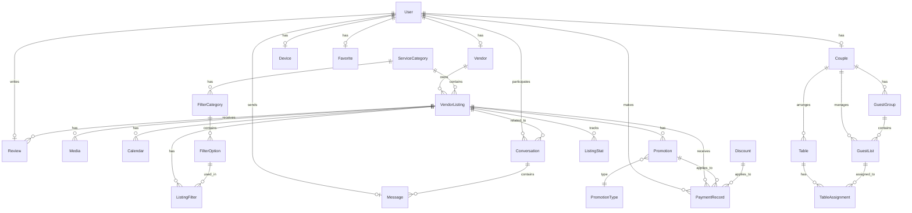

# Dokumentacja Techniczna WeddingApp cz.2 Modele i Endpointy

[TOC]

---

## 4. Modele Danych (Sequelize)

### 4.1. Podstawowe Modele Użytkowników

#### 4.1.1. User
- **Tabela**: `Users`
- **Klucz główny**: `id` (INTEGER UNSIGNED, auto_increment)
- **Pola**:
  - `userType`: ENUM('vendor', 'couple', 'admin')
  - `email`: STRING(255), unique
  - `passwordHash`: STRING(255), nullable
  - `phoneNumber`: STRING(50), nullable, unique
  - `googleId`: STRING(255), nullable, unique
  - `status`: ENUM('active', 'blocked', 'deactivated', 'deleted')
  - `lastLoginAt`: DATE, nullable
  - `created_at`, `updated_at`: timestamps
- **Relacje**:
  - hasOne: Vendor, Couple (profile)
  - hasMany: Device, Review, Message, Favorite, Log, NotificationRecipient, UserNotificationSetting, PaymentRecord

#### 4.1.2. Vendor
- **Tabela**: `Vendors`
- **Klucz główny**: `vendorId` (INTEGER UNSIGNED, FK do Users)
- **Pola**:
  - `companyName`: STRING(255)
  - `serviceCategoryId`: INTEGER UNSIGNED, nullable, FK do ServiceCategories
  - `locationCity`: STRING(255), nullable
  - `offersNationwideService`: BOOLEAN, default false
  - `googleCalendarId`: STRING(255), nullable
  - `googleAccessToken`: STRING(255), nullable
  - `googleRefreshToken`: STRING(255), nullable
- **Relacje**:
  - belongsTo: User
  - hasMany: VendorListing, ListingTemplate

#### 4.1.3. Couple
- **Tabela**: `Couples`
- **Klucz główny**: `coupleId` (INTEGER UNSIGNED, FK do Users)
- **Pola**:
  - `weddingDate`: DATEONLY, nullable
  - `partner1Name`: STRING(255)
  - `partner2Name`: STRING(255), nullable
- **Relacje**:
  - belongsTo: User
  - hasMany: GuestGroup, GuestList, Table

### 4.2. Modele Związane z Ofertami

#### 4.2.1. ServiceCategory
- **Tabela**: `ServiceCategories`
- **Klucz główny**: `categoryId` (INTEGER UNSIGNED)
- **Pola**:
  - `categoryName`: STRING(255), unique
- **Relacje**:
  - hasMany: VendorListing, ListingTemplate, FilterCategory

#### 4.2.2. VendorListing
- **Tabela**: `VendorListings`
- **Klucz główny**: `listingId` (INTEGER UNSIGNED)
- **Pola**:
  - `vendorId`: INTEGER UNSIGNED, FK do Vendors
  - `categoryId`: INTEGER UNSIGNED, FK do ServiceCategories
  - `title`: STRING(255)
  - `shortDescription`: TEXT, nullable
  - `longDescription`: TEXT, nullable
  - `priceMin`, `priceMax`: DECIMAL(10,2), nullable
  - `rangeInKm`: INTEGER UNSIGNED, default 0
  - `offersNationwideService`: BOOLEAN, default false
  - `contactPhone`: STRING(50), nullable
  - `email`: STRING(255), nullable
  - `websiteUrl`, `facebookUrl`, `instagramUrl`, `youtubeUrl`, `tiktokUrl`, `spotifyUrl`, `soundcloudUrl`, `pinterestUrl`: STRING(255), nullable
  - `city`: STRING(255)
  - `isSuspended`: BOOLEAN, default false
- **Relacje**:
  - belongsTo: Vendor, ServiceCategory
  - hasMany: Media, Review, Calendar, ListingFilter, Favorite, PaymentRecord, Promotion, ListingStat, Conversation

#### 4.2.3. Media
- **Tabela**: `Media`
- **Klucz główny**: `mediaId` (INTEGER UNSIGNED)
- **Pola**:
  - `listingId`: INTEGER UNSIGNED, FK do VendorListings
  - `mediaType`: ENUM('image', 'video')
  - `mediaUrl`: STRING(255)
  - `order`: INTEGER, default 0
  - `isMain`: BOOLEAN, default false
- **Relacje**:
  - belongsTo: VendorListing

### 4.3. Modele Filtrowania i Wyszukiwania

#### 4.3.1. FilterCategory
- **Tabela**: `FilterCategories`
- **Klucz główny**: `filterCategoryId` (INTEGER UNSIGNED)
- **Pola**:
  - `serviceCategoryId`: INTEGER UNSIGNED, FK do ServiceCategories
  - `filterName`: STRING(255)
  - `displayType`: ENUM('checkbox', 'dropdown', 'slider'), default 'checkbox'
- **Relacje**:
  - belongsTo: ServiceCategory
  - hasMany: FilterOption

#### 4.3.2. FilterOption
- **Tabela**: `FilterOptions`
- **Klucz główny**: `filterOptionId` (INTEGER UNSIGNED)
- **Pola**:
  - `filterCategoryId`: INTEGER UNSIGNED, FK do FilterCategories
  - `optionName`: STRING(255)
- **Relacje**:
  - belongsTo: FilterCategory
  - hasMany: ListingFilter

#### 4.3.3. ListingFilter
- **Tabela**: `ListingFilters`
- **Klucz główny**: `listingFilterId` (INTEGER UNSIGNED)
- **Pola**:
  - `listingId`: INTEGER UNSIGNED, FK do VendorListings
  - `filterOptionId`: INTEGER UNSIGNED, FK do FilterOptions
- **Relacje**:
  - belongsTo: VendorListing, FilterOption

### 4.4. Modele Zarządzania Gośćmi

#### 4.4.1. GuestGroup
- **Tabela**: `GuestGroups`
- **Klucz główny**: `groupId` (INTEGER UNSIGNED)
- **Pola**:
  - `coupleId`: INTEGER UNSIGNED, FK do Couples
  - `groupName`: STRING(255)
- **Relacje**:
  - belongsTo: Couple
  - hasMany: GuestList

#### 4.4.2. GuestList
- **Tabela**: `GuestList`
- **Klucz główny**: `guestId` (INTEGER UNSIGNED)
- **Pola**:
  - `coupleId`: INTEGER UNSIGNED, FK do Couples
  - `guestName`: STRING(255)
  - `guestStatus`: ENUM('invited', 'confirmed', 'declined')
  - `groupId`: INTEGER UNSIGNED, FK do GuestGroups, nullable
  - `notes`: TEXT, nullable
- **Relacje**:
  - belongsTo: Couple, GuestGroup
  - hasMany: TableAssignment

#### 4.4.3. Table
- **Tabela**: `Tables`
- **Klucz główny**: `tableId` (INTEGER UNSIGNED)
- **Pola**:
  - `coupleId`: INTEGER UNSIGNED, FK do Couples
  - `tableName`: STRING(255)
  - `tableShape`: ENUM('round', 'rectangular')
  - `maxGuests`: INTEGER UNSIGNED
- **Relacje**:
  - belongsTo: Couple
  - hasMany: TableAssignment

#### 4.4.4. TableAssignment
- **Tabela**: `TableAssignments`
- **Klucz główny**: `assignmentId` (INTEGER UNSIGNED)
- **Pola**:
  - `tableId`: INTEGER UNSIGNED, FK do Tables
  - `guestId`: INTEGER UNSIGNED, FK do GuestList
- **Relacje**:
  - belongsTo: Table, GuestList

### 4.5. Modele Komunikacji

#### 4.5.1. Conversation
- **Tabela**: `Conversations`
- **Klucz główny**: `conversationId` (INTEGER UNSIGNED)
- **Pola**:
  - `user1Id`, `user2Id`: INTEGER UNSIGNED, FK do Users
  - `listingId`: INTEGER UNSIGNED, FK do VendorListings, nullable
  - `isReadByUser1`, `isReadByUser2`: BOOLEAN, default false
- **Relacje**:
  - belongsTo: User (jako user1 i user2), VendorListing
  - hasMany: Message

#### 4.5.2. Message
- **Tabela**: `Messages`
- **Klucz główny**: `messageId` (INTEGER UNSIGNED)
- **Pola**:
  - `conversationId`: INTEGER UNSIGNED, FK do Conversations
  - `senderId`, `receiverId`: INTEGER UNSIGNED, FK do Users
  - `messageContent`: TEXT
- **Relacje**:
  - belongsTo: Conversation, User (jako sender i receiver)

### 4.6. Modele Recenzji i Statystyk

#### 4.6.1. Review
- **Tabela**: `Reviews`
- **Klucz główny**: `reviewId` (INTEGER UNSIGNED)
- **Pola**:
  - `listingId`: INTEGER UNSIGNED, FK do VendorListings
  - `userId`: INTEGER UNSIGNED, FK do Users
  - `ratingQuality`, `ratingCommunication`, `ratingCreativity`, `ratingServiceAgreement`, `ratingAesthetics`: INTEGER UNSIGNED (1-5)
  - `reviewText`: TEXT, nullable
  - `weddingDate`: DATEONLY, nullable
  - `location`: STRING(255), nullable
  - `reviewerName`: STRING(255), nullable
  - `reviewerPhone`: STRING(50), nullable
- **Relacje**:
  - belongsTo: VendorListing, User

#### 4.6.2. ListingStat
- **Tabela**: `ListingStats`
- **Klucz główny**: `statId` (INTEGER UNSIGNED)
- **Pola**:
  - `listingId`: INTEGER UNSIGNED, FK do VendorListings
  - `viewsCount`, `clicksCount`, `inquiriesCount`: INTEGER UNSIGNED, default 0
  - `avgBrowsingTime`: DECIMAL(8,2), default 0.0
  - `mostActiveDay`: STRING(20), nullable
  - `mostActiveHour`: STRING(10), nullable
  - `deviceTypeDistribution`, `activeDaysDistribution`, `activeHoursDistribution`: JSON
  - `period`: ENUM('daily', 'weekly', 'monthly', 'yearly'), default 'daily'
- **Relacje**:
  - belongsTo: VendorListing

### 4.7. Modele Płatności i Promocji

#### 4.7.1. PaymentRecord
- **Tabela**: `PaymentRecords`
- **Klucz główny**: `paymentId` (INTEGER UNSIGNED)
- **Pola**:
  - `userId`: INTEGER UNSIGNED, FK do Users
  - `listingId`: INTEGER UNSIGNED, FK do VendorListings
  - `promotionId`: INTEGER UNSIGNED, FK do Promotions
  - `discountId`: INTEGER UNSIGNED, FK do Discounts
  - `amount`: DECIMAL(10,2)
  - `dueDate`: DATEONLY, nullable
  - `paymentStatus`: ENUM('completed', 'pending', 'failed', 'overdue')
  - `paymentMethod`: ENUM('credit_card', 'paypal', 'bank_transfer')
- **Relacje**:
  - belongsTo: User, VendorListing, Promotion, Discount

#### 4.7.2. Promotion
- **Tabela**: `Promotions`
- **Klucz główny**: `promotionId` (INTEGER UNSIGNED)
- **Pola**:
  - `listingId`: INTEGER UNSIGNED, FK do VendorListings
  - `promotionTypeId`: INTEGER UNSIGNED, FK do PromotionTypes
  - `promotionStatus`: ENUM('active', 'expired', 'pending')
  - `startDate`, `endDate`: DATEONLY
- **Relacje**:
  - belongsTo: VendorListing, PromotionType
  - hasMany: PaymentRecord

### 4.8. Modele Systemowe

#### 4.8.1. Device
- **Tabela**: `Devices`
- **Klucz główny**: `deviceId` (INTEGER UNSIGNED)
- **Pola**:
  - `userId`: INTEGER UNSIGNED, FK do Users
  - `deviceName`: STRING(255)
  - `deviceType`: STRING(50)
  - `ipAddress`: STRING(45)
  - `lastLoginAt`: DATE
- **Relacje**:
  - belongsTo: User

#### 4.8.2. SystemStat
- **Tabela**: `SystemStats`
- **Klucz główny**: `statId` (INTEGER UNSIGNED)
- **Pola**:
  - `totalUsers`, `activeUsers`, `couplesCount`, `vendorsCount`: INTEGER UNSIGNED, default 0
  - `avgListingViews`: DECIMAL(5,2), default 0.0
  - `mostActiveCategory`: STRING(255), nullable
  - `totalInquiries`: INTEGER UNSIGNED, default 0
  - `mostActiveHour`: STRING(10), nullable
  - `mostActiveDay`: STRING(20), nullable
  - `deviceTypeDistribution`: JSON
  - `reportPeriod`: ENUM('daily', 'weekly', 'monthly', 'yearly'), default 'daily'

### 4.9. Diagram ERD



### 4.10. Przykładowe Rekordy

```sql
-- Przykład użytkownika (User)
INSERT INTO Users (id, user_type, email, password_hash, status) 
VALUES (1, 'vendor', 'vendor@example.com', 'hash123', 'active');

-- Przykład vendora (Vendor)
INSERT INTO Vendors (vendor_id, company_name, offers_nationwide_service) 
VALUES (1, 'Wedding Photos Pro', true);

-- Przykład oferty (VendorListing)
INSERT INTO VendorListings (listing_id, vendor_id, category_id, title, city) 
VALUES (1, 1, 1, 'Profesjonalna fotografia ślubna', 'Warszawa');

-- Przykład recenzji (Review)
INSERT INTO Reviews (review_id, listing_id, user_id, rating_quality, review_text) 
VALUES (1, 1, 2, 5, 'Wspaniała obsługa i piękne zdjęcia!');
```
--- 

## 5. Endpointy API

### 5.1. Autentykacja

#### 5.1.1. Logowanie
- **Endpoint**: `POST /auth/login`
- **Opis**: Logowanie użytkownika i uzyskanie tokenu JWT
- **Body**:
  ```json
  {
    "email": "string",
    "password": "string"
  }
  ```
- **Odpowiedź**: Token JWT i dane użytkownika

#### 5.1.2. Rejestracja
- **Endpoint**: `POST /auth/register`
- **Opis**: Rejestracja nowego użytkownika
- **Body**:
  ```json
  {
    "email": "string",
    "password": "string",
    "phoneNumber": "string",
    "userType": "vendor" | "couple",
    "companyName": "string" // dla vendora
    // lub
    "partner1Name": "string", // dla couple
    "partner2Name": "string"  // dla couple, opcjonalne
  }
  ```
- **Odpowiedź**: Link aktywacyjny wysyłany na email

#### 5.1.3. Weryfikacja Konta
- **Endpoint**: `GET /auth/verify`
- **Query Params**: `token=string`
- **Opis**: Weryfikacja konta poprzez token z emaila

### 5.2. Zarządzanie Użytkownikiem

#### 5.2.1. Aktualizacja Profilu
- **Endpoint**: `PUT /api/users/update`
- **Auth**: Required
- **Body** (wszystkie pola opcjonalne):
  ```json
  {
    "email": "string",
    "password": "string",
    "phoneNumber": "string",
    "weddingDate": "YYYY-MM-DD", // tylko dla couple
    "partner1Name": "string",     // tylko dla couple
    "partner2Name": "string"      // tylko dla couple
  }
  ```

#### 5.2.2. Szczegóły Użytkownika
- **Endpoint**: `GET /api/users/:userId/details`
- **Auth**: Required
- **Odpowiedź**: Pełne dane użytkownika z profilami

#### 5.2.3. Lista Użytkowników
- **Endpoint**: `GET /api/users`
- **Auth**: Required (Admin)
- **Query Params**:
  - `page`: number (default: 1)
  - `limit`: number (default: 40)

#### 5.2.4. Zmiana Statusu
- **Endpoint**: `PUT /api/users/status`
- **Auth**: Required (Admin)
- **Body**:
  ```json
  {
    "userId": "number",
    "status": "active" | "blocked" | "deleted"
  }
  ```

### 5.3. Zarządzanie Ofertami

#### 5.3.1. Dodawanie Oferty
- **Endpoint**: `POST /api/listings/add`
- **Auth**: Required (Vendor)
- **Body**:
  ```json
  {
    "vendorId": "number",
    "categoryId": "number",
    "titleOffer": "string",
    "shortDescription": "string",
    "longDescription": "string",
    "priceMin": "number",
    "priceMax": "number",
    "rangeInKm": "number",
    "offersNationwideService": "boolean",
    "contactPhone": "string",
    "email": "string",
    "city": "string",
    "filterOptions": "number[]",
    "media": [
      {
        "mediaType": "image" | "video",
        "mediaUrl": "string"
      }
    ],
    "links": {
      "websiteUrl": "string",
      "facebookUrl": "string",
      "youtubeUrl": "string",
      "instagramUrl": "string",
      "tiktokUrl": "string",
      "spotifyUrl": "string",
      "soundcloudUrl": "string",
      "pinterestUrl": "string"
    }
  }
  ```

#### 5.3.2. Pobieranie Ofert
- **Lista ofert kategorii**: `GET /api/listings/category/:categoryId`
- **Szczegóły oferty**: `GET /api/listings/listing/:listingId`
- **Oferty użytkownika**: `GET /api/listings/user/:userId`

#### 5.3.3. Usuwanie Oferty
- **Endpoint**: `DELETE /api/listings/:listingId`
- **Auth**: Required (Vendor/Admin)

#### 5.3.4. Statystyki Oferty
- **Endpoint**: `GET /api/listings/stats/:listingId`
- **Auth**: Required (Vendor)
- **Aktualizacja czasu**: `POST /api/listings/time-spent`
  ```json
  {
    "listingId": "number",
    "timeSpent": "number" // w sekundach
  }
  ```

### 5.4. Zarządzanie Kategoriami i Filtrami

#### 5.4.1. Kategorie
- **Lista nazw**: `GET /api/categories/names`
- **Szczegóły kategorii**: `GET /api/categories/details`

#### 5.4.2. Filtry
- **Filtry kategorii**: `GET /api/filters/:categoryId`

### 5.5. Zarządzanie Gośćmi

#### 5.5.1. Lista Gości
- **Pobieranie**: `GET /api/guests/:coupleId`
- **Dodawanie**: `POST /api/guests/add`
  ```json
  {
    "coupleId": "number",
    "guestName": "string",
    "guestStatus": "invited" | "confirmed" | "declined",
    "groupId": "number?",
    "notes": "string?"
  }
  ```
- **Aktualizacja**: `PUT /api/guests/:guestId`
- **Usuwanie**: `DELETE /api/guests/:guestId`

#### 5.5.2. Grupy Gości
- **Lista grup**: `GET /api/guests/groups/:coupleId`
- **Dodawanie grupy**: `POST /api/guests/group/add`
  ```json
  {
    "coupleId": "number",
    "groupName": "string"
  }
  ```
- **Usuwanie grupy**: `DELETE /api/guests/group/:groupId`

#### 5.5.3. Import/Export
- **Import gości**: `POST /api/guests/import` (multipart/form-data)
- **Pobierz szablon**: `GET /api/guests/template`

### 5.6. Plan Stołów

#### 5.6.1. Zarządzanie Stołami
- **Lista stołów**: `GET /api/tables/:coupleId`
- **Dodawanie stołu**: `POST /api/tables/add`
  ```json
  {
    "coupleId": "number",
    "tableName": "string",
    "tableShape": "round" | "rectangular",
    "maxGuests": "number"
  }
  ```
- **Edycja stołu**: `PUT /api/tables/:tableId`
- **Usuwanie stołu**: `DELETE /api/tables/:tableId`

#### 5.6.2. Przypisanie Gości
- **Przypisanie**: `POST /api/tables/assign`
  ```json
  {
    "tableId": "number",
    "guestId": "number"
  }
  ```
- **Usunięcie przypisania**: `POST /api/tables/remove-assignment`
- **Goście bez stołów**: `GET /api/tables/guests/:coupleId/without-table`

### 5.7. Komunikacja

#### 5.7.1. Konwersacje
- **Lista konwersacji**: `GET /api/conversations/:userId`
- **Wiadomości konwersacji**: `GET /api/conversations/:conversationId/messages`
- **Oznacz jako przeczytane**: `PUT /api/conversations/:conversationId/read`
  ```json
  {
    "userId": "number"
  }
  ```

#### 5.7.2. Wiadomości
- **Wysłanie wiadomości**: `POST /api/conversations/message`
  ```json
  {
    "senderId": "number",
    "receiverId": "number",
    "listingId": "number",
    "messageContent": "string"
  }
  ```

### 5.8. Powiadomienia

#### 5.8.1. Powiadomienia Użytkownika
- **Lista powiadomień**: `GET /api/notifications/:userId`
- **Oznacz jako przeczytane**: `POST /api/notifications/mark-as-read`
  ```json
  {
    "userId": "number",
    "notificationId": "number"
  }
  ```

#### 5.8.2. Ustawienia Powiadomień
- **Aktualizacja ustawień**: `PUT /api/users/update-setting`
  ```json
  {
    "userId": "number",
    "notificationType": "email" | "app",
    "eventType": "string",
    "isEnabled": "boolean"
  }
  ```

### 5.9. Panel Admina

#### 5.9.1. Powiadomienia
- **Lista**: `GET /api/admin/notifications`
  - Query params: `page`, `limit`, `search`, `sortBy`, `order`
- **Szczegóły**: `GET /api/admin/notifications/:id`
- **Dodaj**: `POST /api/admin/notifications`
  ```json
  {
    "title": "string",
    "message": "string",
    "notificationType": "app" | "email",
    "recipientsGroup": "string",
    "recipientIds": "number[]"
  }
  ```
- **Usuń**: `DELETE /api/admin/notifications/:id`
- **Wyślij ponownie**: `POST /api/admin/notifications/resend/:id`

#### 5.9.2. Filtrowanie Użytkowników
- **Endpoint**: `GET /api/admin/ids`
- **Query Params**:
  - `categoryId`: number
  - `userType`: "vendor" | "couple"
  - `status`: "active" | "blocked" | "deleted"

### 5.10. Statystyki i Raporty

#### 5.10.1. Statystyki Systemowe
- **Endpoint**: `GET /api/system-stats`
- **Odpowiedź**: Globalne statystyki systemu

#### 5.10.2. Raporty
- **Lista raportów**: `GET /api/reports`
  - Query params: `page`, `limit`, `reportType`, `search`
- **Generowanie raportu**: `POST /api/reports/generated-reports`
  ```json
  {
    "reportType": "daily" | "weekly" | "monthly"
  }
  ```

### 5.11. Kalendarz

#### 5.11.1. Zarządzanie Terminami
- **Modyfikacja terminu**: `POST /api/calendar/modify`
  ```json
  {
    "action": "add" | "remove",
    "listingId": "number",
    "date": "YYYY-MM-DD",
    "availabilityStatus": "booked" | "reserved"
  }
  ```

---
