# 🎉 Wedding App  

Aplikacja do zarządzania usługodawcami w branży ślubnej.  
Pozwala na wyszukiwanie ofert, filtrowanie, kontakt i ocenianie usługodawców.  

## 📸 Zrzuty ekranu  
Poniżej jest główna sekcja, gdzie wybierana jest kategoria usług, miejscowość wyszukiwania ofert oraz przycisk szukaj, który po kliknięciu pozwala przejść do sekcji listy ofert. 
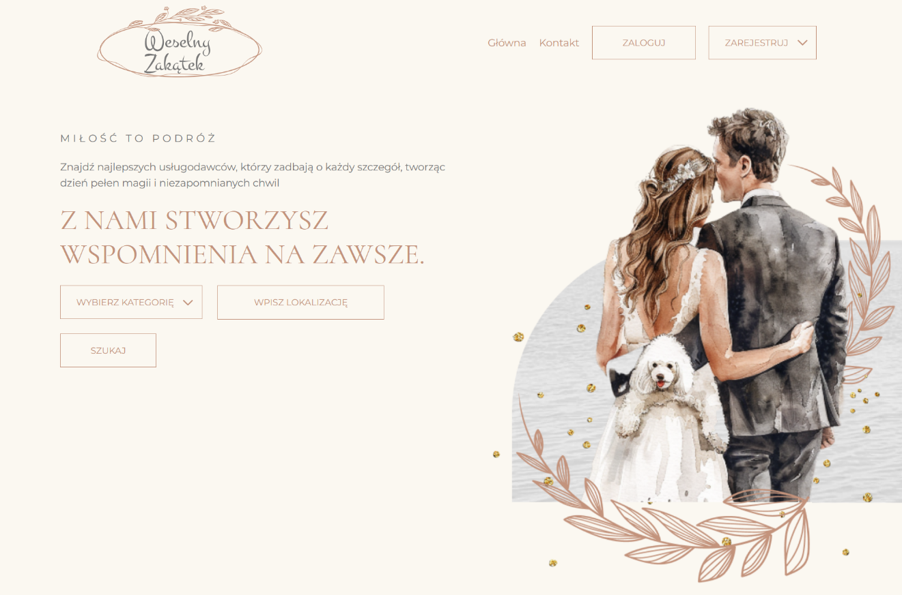  
 
Po wybraniu kategorii i miejscowości wyświetlają się wszystkie oferty związane z wybranymi filtrami. Początkowo wyświetlają się tylko oferty usługodawców, którzy uwzględniają możliwość dojazdu do wybranej miejscowości. Aby ograniczyć oferty do jednej miejscowości, poprzez odpowiedni przycisk należy zmienić opcję na oferty tylko z tej miejscowości. Oferty usługodawców przedstawione są w formie krótkich kart z najważniejszymi informacjami takimi jak: nazwa oferty, miejscowość, krótki opis oraz cena. Pojedyncza karta zawiera przycisk, który przenosi użytkownika do szczegółów wybranej oferty.  
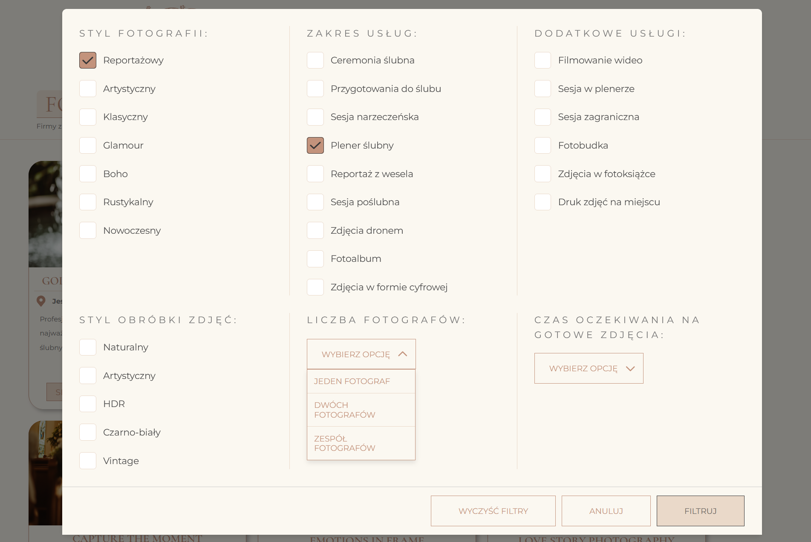 
Dla wybranej kategorii przypisane są konkretne filtr. Aby  jeszcze bardziej zawęzić wyświetlanie ofert po kliknięciu w przycisk pokazuje się okno modal z widocznymi filtrami.  
  
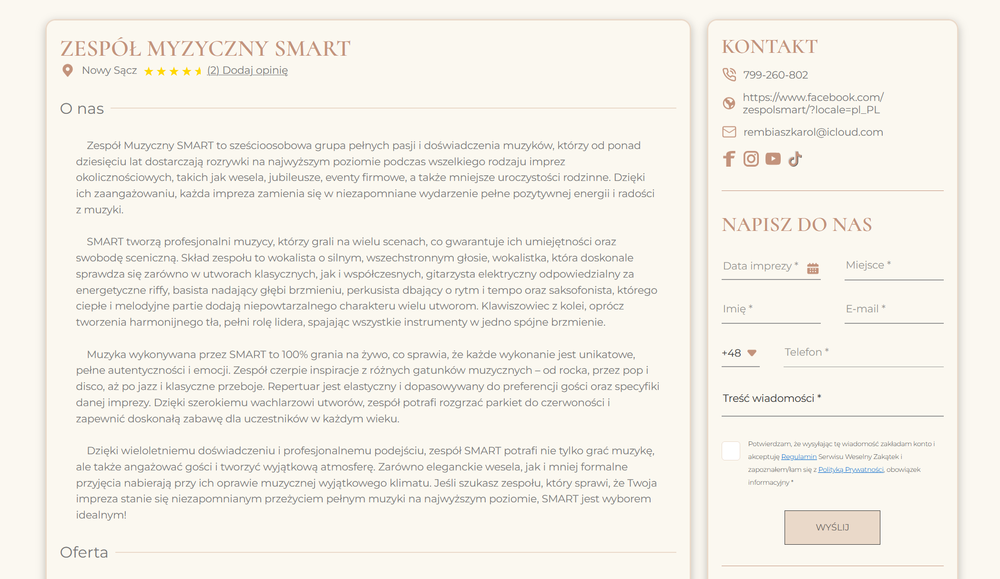  
Szczegóły oferty zawierają galerię zdjęć, którą można przeglądać przesuwając zdjęcia w prawo i lewo. Pod galerią oferta zawiera dokładne informację, w tym tytuł,, miejscowość, średnia wystawionych opinii w postaci gwiazdek. Poniżej przedstawiony jest szczegółowy opis oferty. W zależności od wybranej kategorii następnie ukazują się dodatkowe informacje o usłudze. Przedstawiona jest także cena ustalona przez usługodawcę. Z prawej strony znajduje się sekcja związana z kontaktem do usługodawcy. Podany jest numer telefonu, adres strony internetowej, adres e-mail oraz linki do social mediów. Poniżej przedstawiony jest formularz kontaktowy przez który para młoda może wysłać zapytanie. W tej sekcji jest także kalendarz pokazujący dostępność terminów oferty oraz lokalizacja.
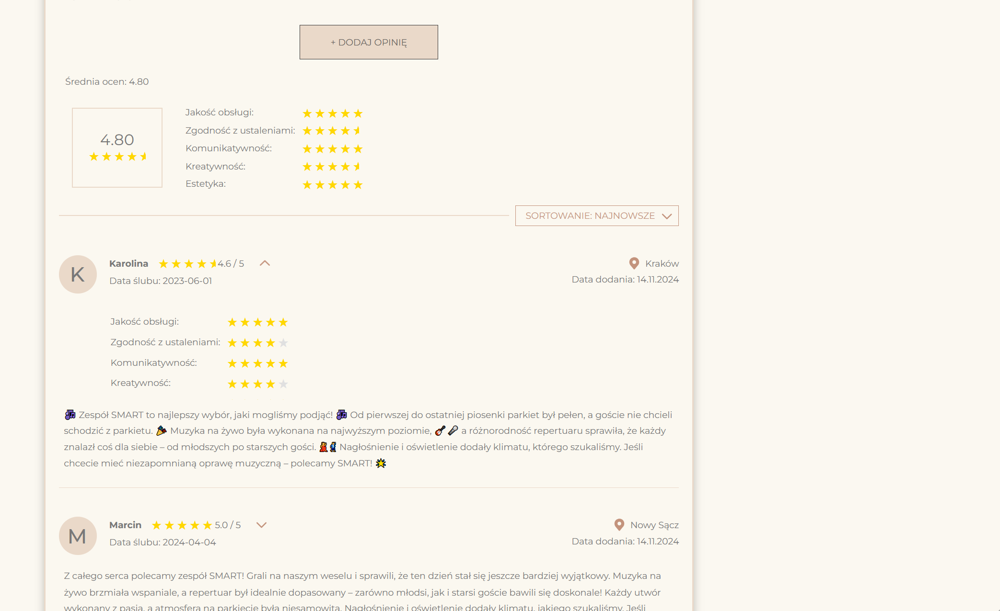  
W dolnej części szczegółów oferty znajduje się sekcja opinii i recenzji. Widoczne są opinie wystawione przez innych użytkowników aplikacji. Najpierw wyświetla się średnia wszystkich opinii z podziałem na kategorie. Poniżej znajdują się dodane opinie, które można rozwijać i przeglądać bardziej szczegółowo. Wszystkie opinie można sortować ze względu na najnowsze, najwyżej oceniane, najniżej oceniane. 
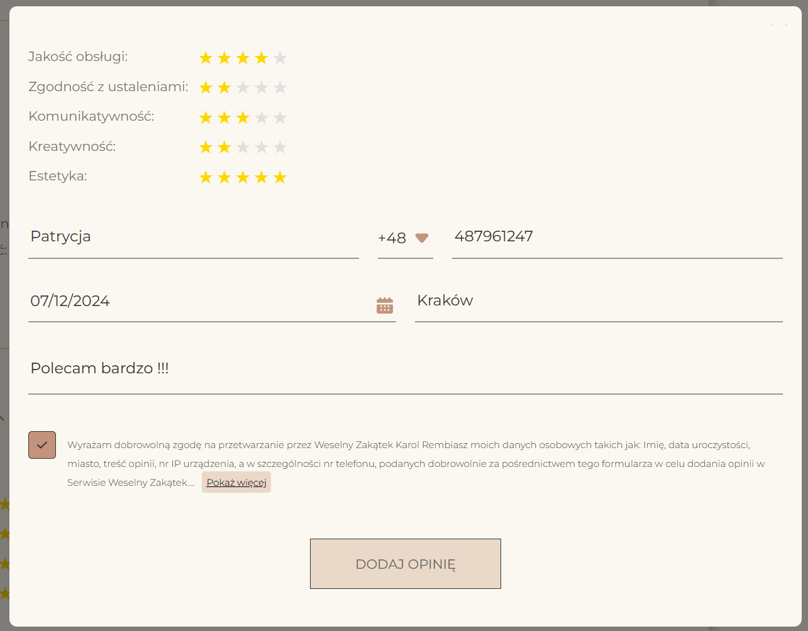  
Dodanie nowej opinii wymaga zalogowania się oraz uzupełnienia formularza poprzez zaznaczenie ilości gwiazdek dla przydzielonej kategorii opinii, dodanie imienia, numeru telefonu do weryfikacji, datę przyjęcia, miejscowość oraz treść opinii. 
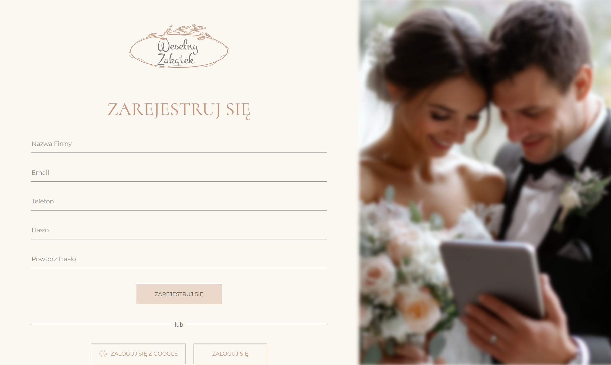  
Panel rejestracji jest w dwóch wersjach: dla konta pary młodej oraz dla konta firmy. Oba panele różnią się jedynie polami, które należy uzupełnić. Należy podać nazwę, email, telefon, hasło. 
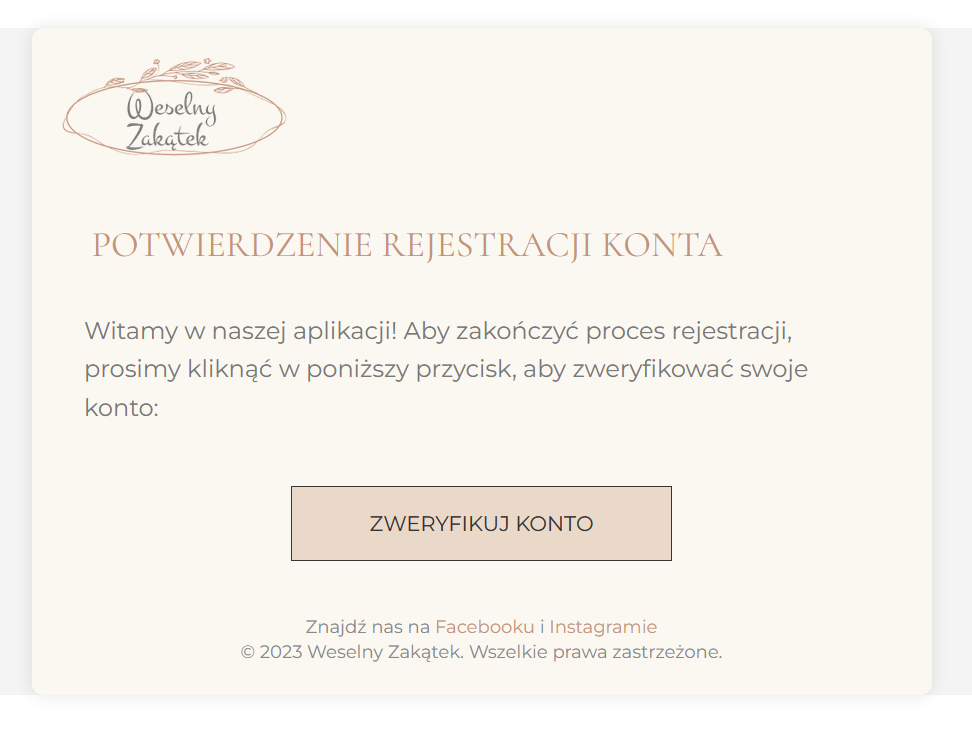  
Po kliknięciu przycisku zarejestruj się na adres email wysyłana jest automatyczna wiadomość z potwierdzeniem rejestracji konta, by zweryfikować podany email. Po poprawnym potwierdzeniu przenosi użytkownika na stronę logowania. W przeciwnym razie ukazuje się błąd utworzenia konta. 
 
Po poprawnym założeniu konta użytkownik swoimi danymi może zalogować się na konto poprzez wpisanie adresu email oraz hasła.  
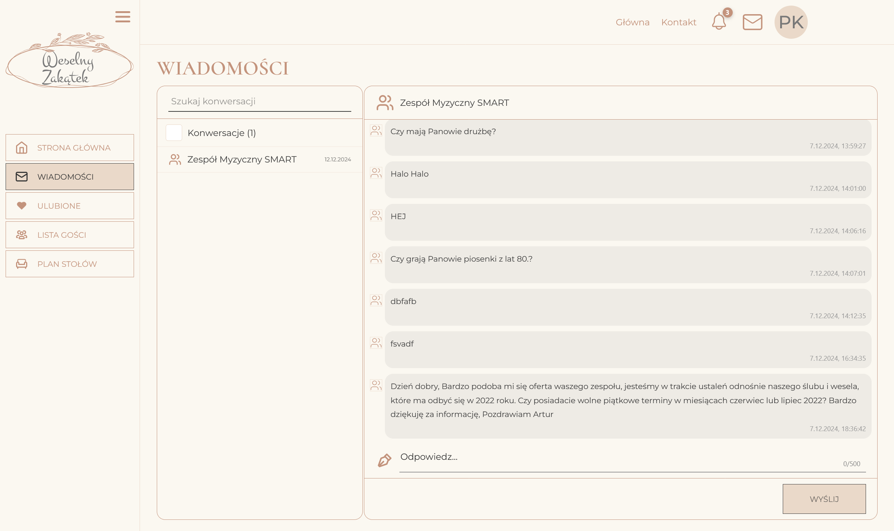 
Po zalogowaniu na konto pary młodej pokazuje się strona główna z widżetem odliczającym dni do przyjęcia weselnego. Para młoda po zalogowaniu wybiera datę swojego ślubu, dzięki czemu poprawnie odliczane są dni do przyjęcia. Po lewej stronie znajduje się menu z przyciskami przekierowującymi do odpowiednich sekcji.  W prawym górnym rogu znajduje się pasek z pojawiającymi się powiadomieniami i wiadomościami.  

Po kliknięciu w przycisk wiadomości z lewej strony ekranu wyświetla się sekcja wiadomości z usługodawcami, która umożliwia komunikację poprzez czat. 
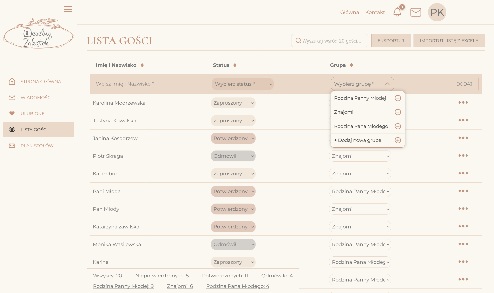  
Klikając w przycisk lista gości ukazuje się panel umożliwiający zarządzanie listą gości weselnych. Chcąc dodać gościa weselnego należy uzupełnić przeznaczony do tego wiersz w tabeli i kliknąć dodaj. Po dodaniu osoby można zmienić jej status zaproszenia oraz grupę. Ostatnia kolumna tabeli zawiera przycisk, który służy do dodania notatki oraz usunięcia gościa z listy.  W dolnej części znajduje się pasek podsumowania, który przedstawia ilość wszystkich osób w danej grupie. Na górze jest opcja wyszukania konkretnego nazwiska wśród listy gości. Istnieje również opcja sortowania każdej z kolumn klikając na nagłówek. 
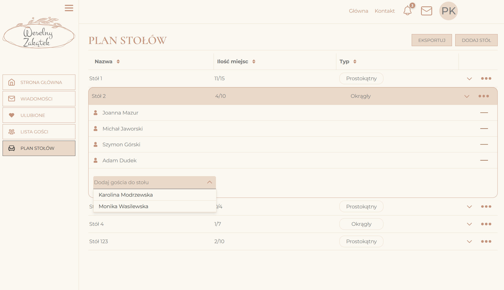  
W zakładce planowania stołów ukazuje się panel umożliwiający zarządzanie listą stołów. Użytkownik klikając przycisk dodaj stół w prawym górnym rogu wyświetla się okno modal, które umożliwia dodanie nowego stołu, wybranie jego kształtu, nazwy i maksymalnej ilości miejsc przy stole. Po utworzeniu stołu można do niego dodać gości wygenerowanych z zrobionej listy gości w poprzednim panelu. Lista nieprzypisanych gości jest automatycznie aktualizowana, co uniemożliwia ponowne dodanie gościa do stołu. W łatwy sposób można edytować stoły zmieniając ich nazwę, ilość miejsc, usuwając gości. Po kliknięciu przycisku eksportuj tworzy się plik pdf z listą stworzonych stołów. Każdy stół mieści się na osobnej stronie pdf.
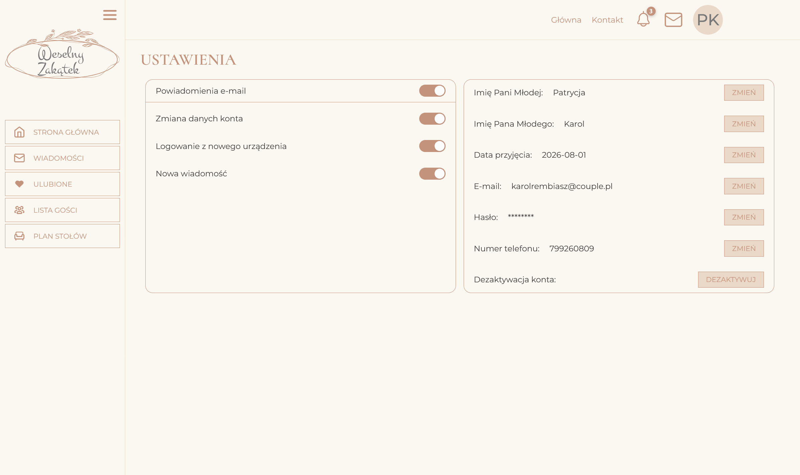  
Klikając w prawym górnym rogu w ikonę inicjałów pary młodej można przejść do ustawień konta. W tej sekcji istnieje możliwość włączenia powiadomień przychodzących na adres email z podziałem na typy powiadomień. Użytkownik ma możliwość zmiany danych konta oraz dezaktywacji konta. 
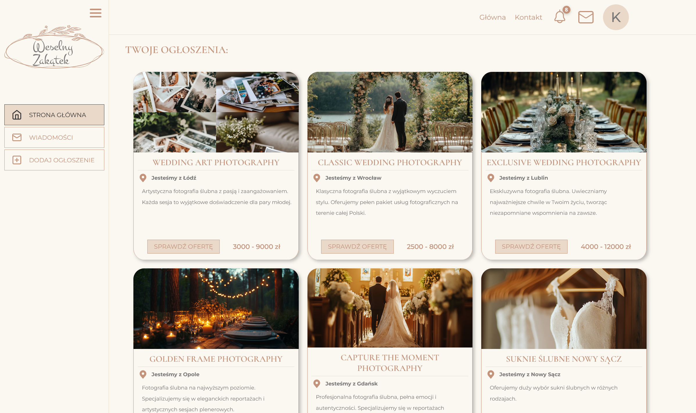  
Logując się na konto usługodawcy wyświetlają się dodane wcześniej ogłoszenia. Klikając przycisk sprawdź ofertę można przejść do szczegółów i statystyk danego ogłoszenia. 
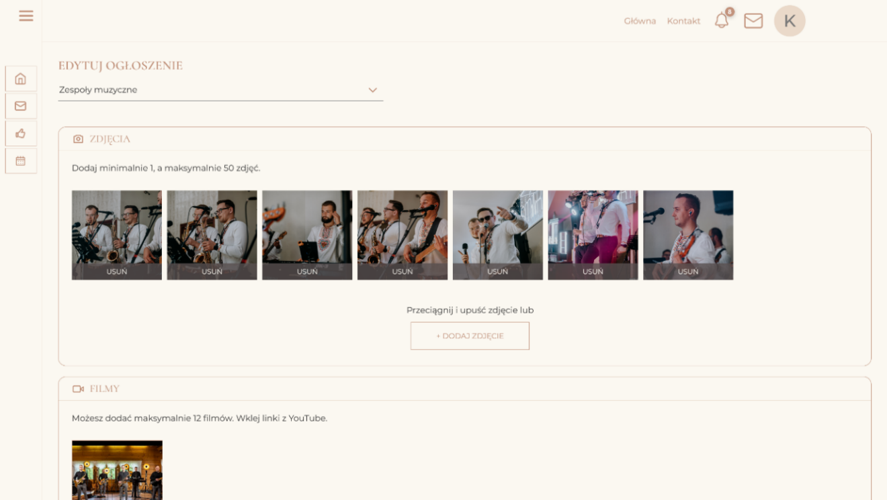  
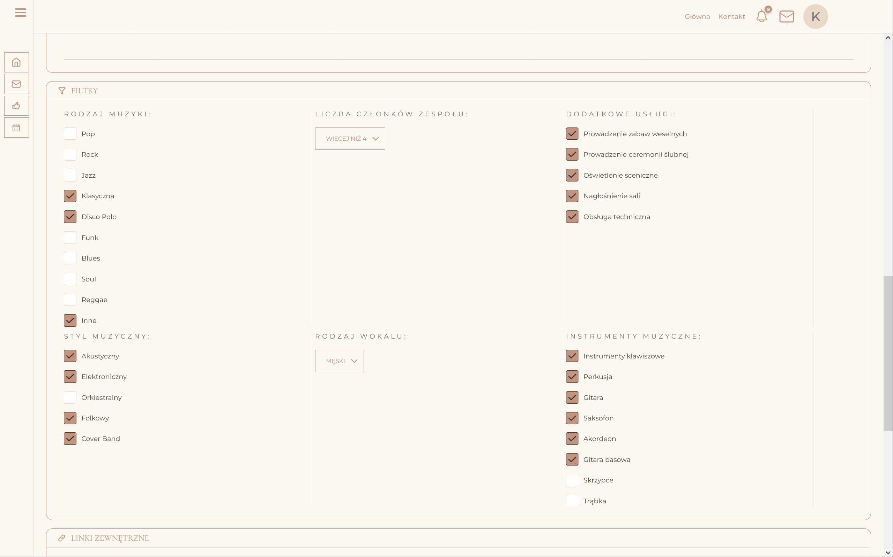
W panelu edycji można zmienić kategorię ogłoszenia, dodać lub usunąć zdjęcia, dodać lub usunąć filmy z portalu YouTube. Następnie w ogłoszeniu można zmienić tytuł, krótki opis oraz szczegółowy opis. Poniżej znajdują się filtry, które w łatwy sposób można zmienić. Można również zamieścić linki zewnętrzne do stron internetowych, dane kontaktowe i lokalizację.  
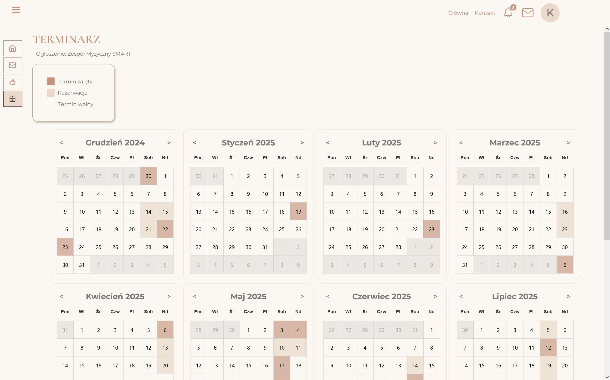  
Z lewej strony ekranu znajduje się również przycisk przenoszący użytkownika do sekcji z terminarzem. Usługodawca dla danego ogłoszenia może uzupełnić, które terminy są zajęte lub zarezerwowane. Pozostałe niezaznaczone odpowiednio terminy oznaczają termin wolny. Kolorystyka zaznaczonych dni przedstawiona jest w legendzie dla lepszej orientacji w kalendarzu. 
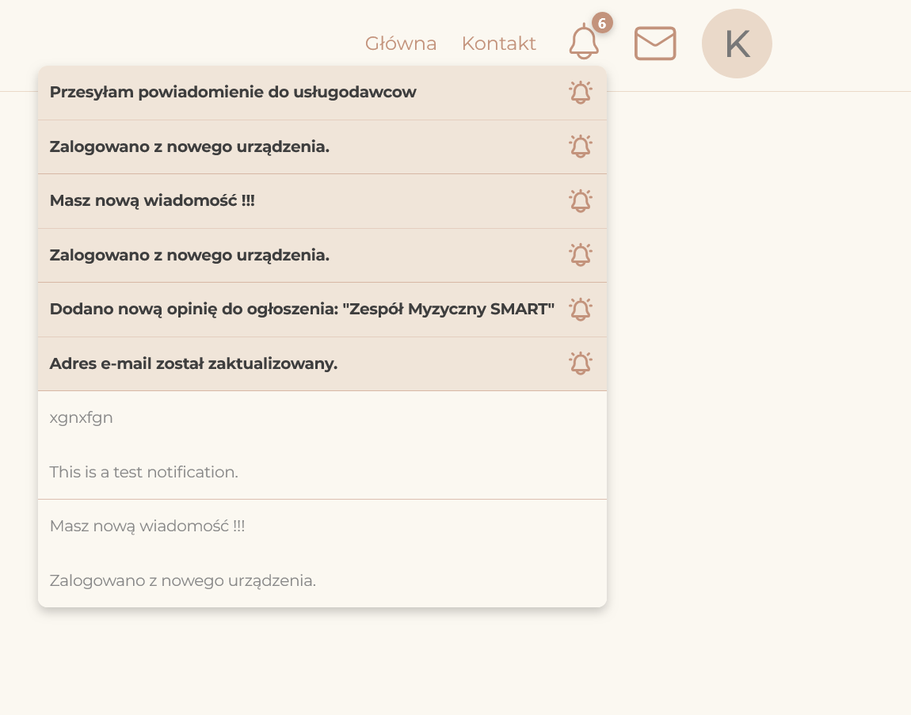  
W górnej części ekranu jest ikona dzwoneczka, przy której wyświetlana jest liczba nieprzeczytanych powiadomień. Klikając w tę ikonę rozwija się okno powiadomień. Znajdują się w nim wszystkie nieprzeczytane powiadomienia, które są oznaczone ciemniejszym kolorem i inną ikoną, dzięki czemu w łatwy sposób można zobaczyć nowe powiadomienia. W przypadku dużej ilości nieprzeczytanych powiadomień istnieje możliwość rozwinięcia okna powiadomień. Aby odczytać powiadomienie należy kliknąć w odpowiedni wiersz. 
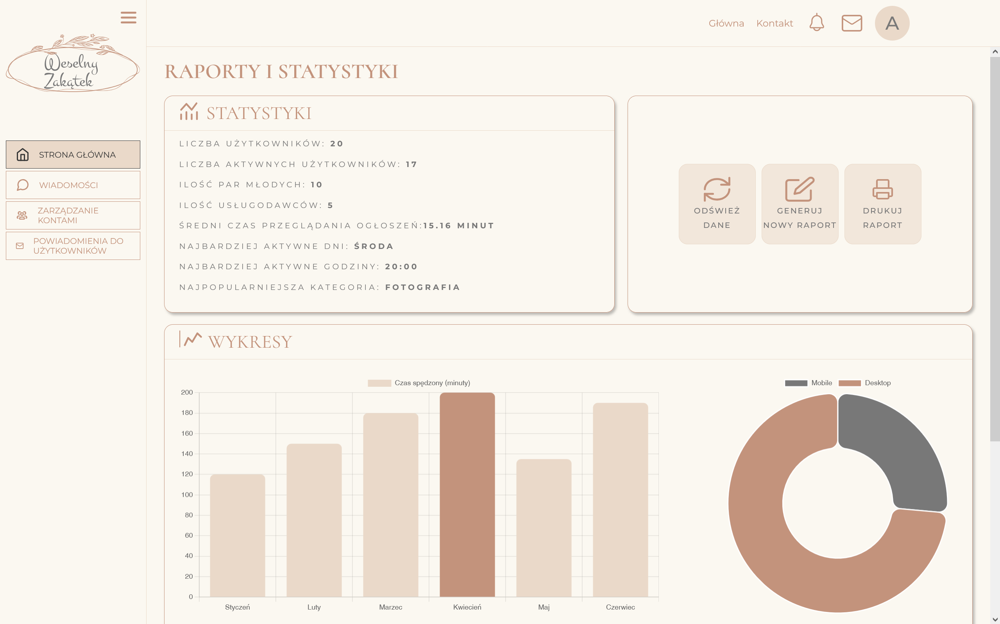  
Logując się jako administrator systemu na stronie głównej znajdują się statystyki odnoszące się do całego systemu. Statystyki przedstawione są w formie tekstowej. Poniżej w formie wykresów przedstawiony jest czas spędzony w aplikacji rozdzielony na pojedyncze miesiące w roku. Natomiast wykres obok wskazuje procentowy stosunek przeglądania aplikacji przez urządzenia mobilne lub typu desktop. Administrator ma możliwość generowania raportów z wszystkich statystyk oraz ich drukowania. 
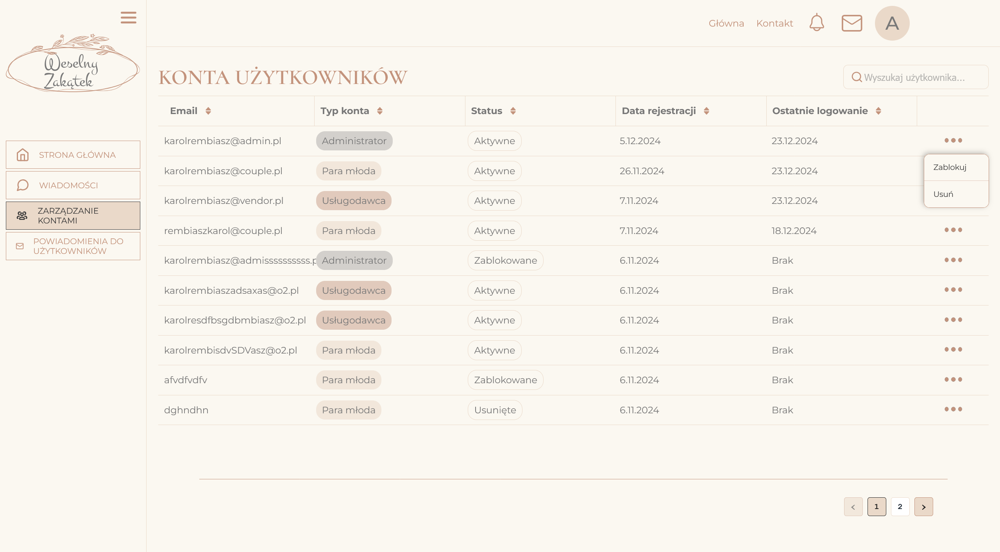 
Administrator ma możliwość zarządzania kontami użytkowników. Może przeglądać dane użytkowników, zablokować lub usunąć konto. Ma również podgląd do czasów rejestracji oraz ostatniego logowania.  
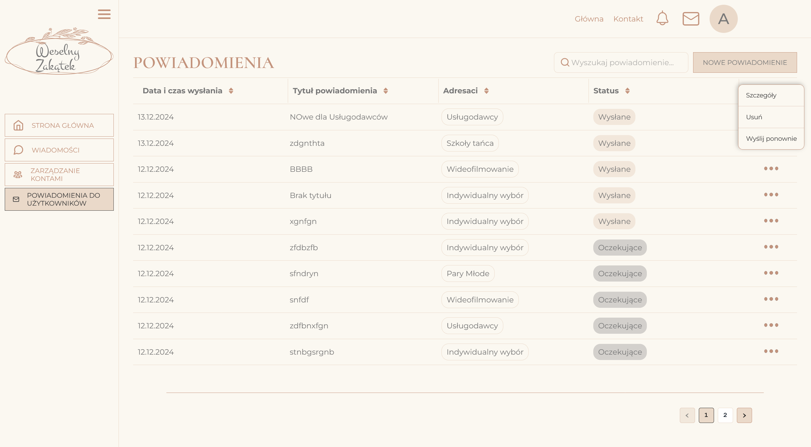  
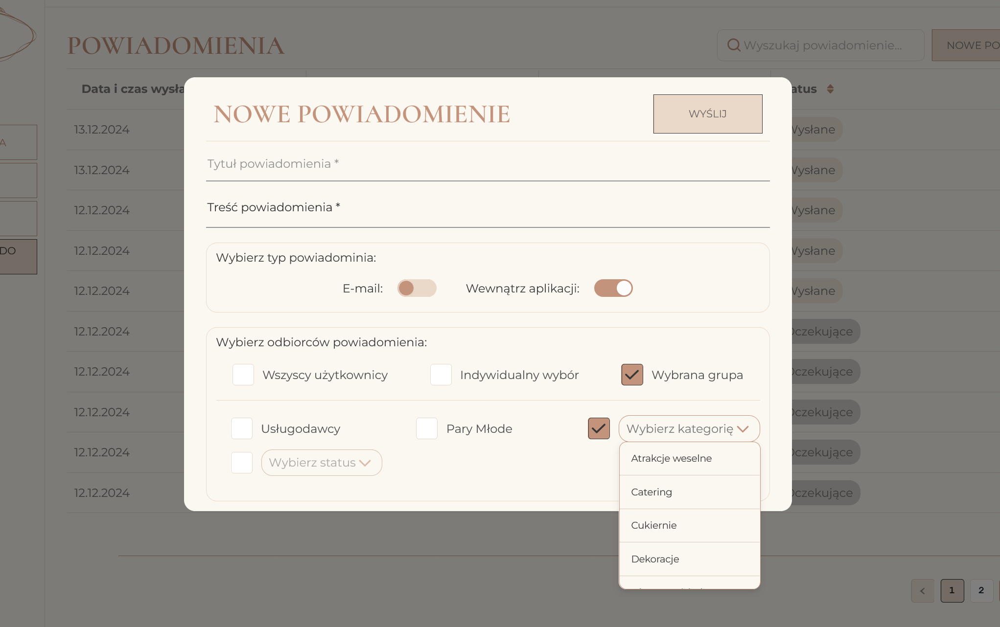  
Zakładka powiadomienia pokazuje listę wszystkich wysłanych przez administratora powiadomień z możliwością wyszukiwania oraz sortowania listy. Każdego powiadomienia można wyświetlić szczegóły, usunąć oraz wysłać ponownie powiadomienie. Ukazuje się również status odczytania powiadomienia przez użytkownika. W tej zakładce administrator ma możliwość utworzyć nowe powiadomienie w modalu wpisując tytuł powiadomienia, treść, typ powiadomienia oraz ma możliwość wyboru odbiorców. Wysłane powiadomienie pokaże się każdemu użytkownikowi, któremu wysłane zostało powiadomienie. 

## 🔧 Technologie  
- **Frontend:** React, TypeScript, Redux  
- **Backend:** Node.js, Express, MySQL, Sequelize  

## 🚀 Jak uruchomić lokalnie?  
1. **Sklonuj repozytorium:**  
   ```bash
   git clone ....
